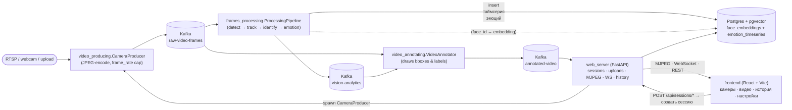
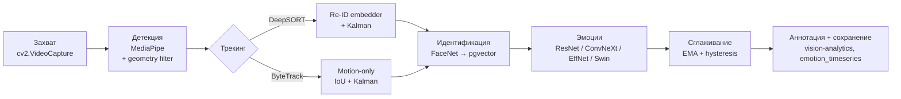
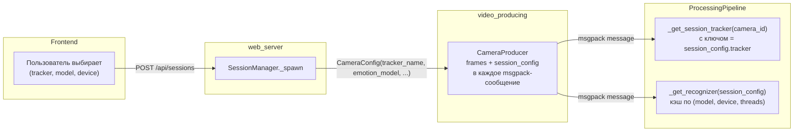
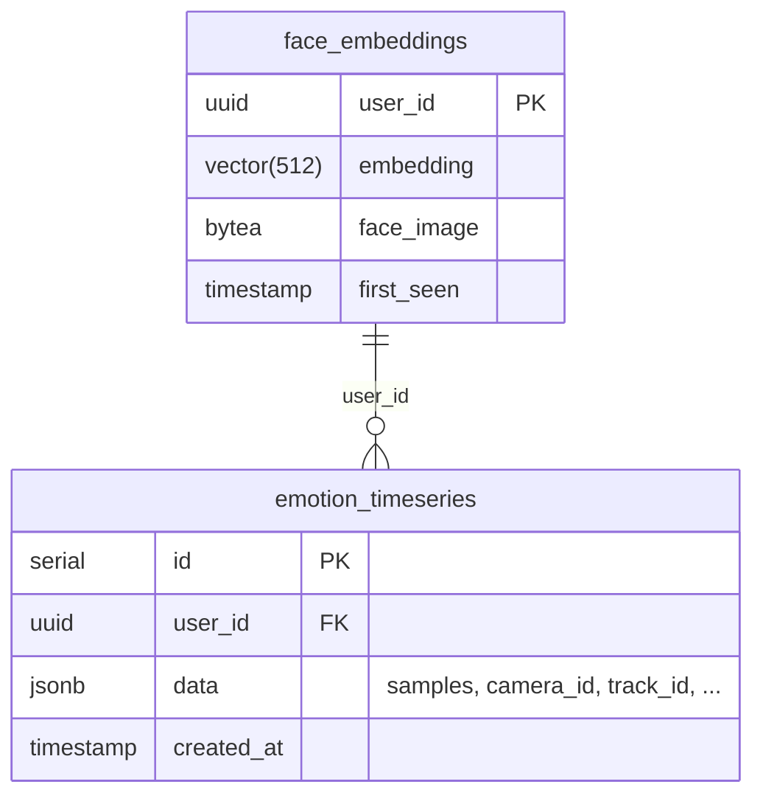

# Affectra — система распознавания эмоций по лицу

Локальная (или работающая в локальной сети) система реального времени, которая
**обнаруживает**, **отслеживает**, **идентифицирует** и **читает эмоции** каждого
лица из одного или нескольких видеоисточников. Результаты сохраняются как
таймсерия в Postgres + pgvector и доступны через веб-интерфейс — с поиском
конкретного человека по фото и подробными графиками вероятностей по эмоциям.

> НИР, 4 курс, 1 семестр. Видео не покидает локальную сеть; внешние API не
> используются.

---

## 1. Общая архитектура

Сервисы общаются через Kafka и не знают друг о друге — каждый можно
перезапускать или масштабировать независимо.



Подробнее о слоях — в [`docs/ARCHITECTURE.md`](docs/ARCHITECTURE.md);
карта кода и документация по каждому Python-модулю —
в [`docs/CODE_OVERVIEW.md`](docs/CODE_OVERVIEW.md) и
[`docs/modules/`](docs/modules/README.md).

---

## 2. Обработка одного кадра

Пять стадий, каждую алгоритм можно заменить:



Полные пути обработки и интерфейсы каждого шага — в
[`docs/ARCHITECTURE.md#стадии-обработки`](docs/ARCHITECTURE.md).

---

## 3. Per-session routing

Каждая сессия (камера или загруженное видео) может использовать **свой**
трекер, **свою** модель эмоций и **своё** устройство. Конфигурация уезжает в
Kafka-сообщении и поднимает ленивые per-session ресурсы в пайплайне.



Это позволяет, например, держать одновременно одну сессию на **ByteTrack +
ResNet-18 INT8** для быстрого мониторинга и другую на **DeepSORT +
ConvNeXt** для качественного анализа — без перезапуска пайплайна.

---

## 4. Поток данных в БД



`data` — JSONB следующего вида:

```json
{
  "camera_id": "upload_8922b7",
  "track_id": 12,
  "started_at": 1762538732.41,
  "ended_at": 1762538745.18,
  "samples": [
    { "t": 1762538733.22, "label": "neutral", "scores": [0.04, 0.03, 0.02, 0.05, 0.81, 0.02, 0.02, 0.01] },
    ...
  ]
}
```

Порядок `scores` — `anger, contempt, disgust, fear, happy, neutral, sad, surprise`.

---

## 5. Запуск

### 5.1. Инфраструктура (один раз)

```powershell
docker compose -f kafka_server\docker-compose.yml up -d
docker compose -f faces_emotions_database\docker-compose.yaml up -d
```

### 5.2. Бэкенд-сервисы

В отдельных окнах:

```powershell
python consumer.py        # ProcessingPipeline
python visualizer.py      # VideoAnnotator
python webapp.py          # FastAPI web server  → http://localhost:8000
```

### 5.3. Frontend

```powershell
cd frontend
npm install
npm run dev               # → http://localhost:5173
```

`vite.config.ts` проксирует `/api/*` и `ws://api/events/*` на `:8000`,
так что фронтенд и Swagger делят одну API-поверхность.

### 5.4. Опционально — INT8-варианты моделей

```powershell
python scripts/quantize_emotion_model.py
```

Создаст `*.int8.onnx` для каждой ONNX-модели в
`src/frames_processing/processing/emotion_recognition/models/`.

---

## 6. Результаты бенчмарка (Intel Core i5-1135G7, CPU-only, 400 кадров)

| config | FPS | mean ms | p50 ms | p95 ms | p99 ms | ΔRSS, MB |
|---|---:|---:|---:|---:|---:|---:|
| `bytetrack_resnet18_t7_seq` | **52.9** | 11.3 | 8.0 | 26.0 | 37.8 | 52 |
| `bytetrack_resnet18_t7` | 47.7 | 12.6 | 9.1 | 30.0 | 51.0 | 50 |
| `bytetrack_resnet18_t2` | 40.5 | 16.4 | 9.5 | 51.1 | 83.1 | 50 |
| `bytetrack_resnet50` | 38.3 | 15.9 | 8.5 | 50.0 | 65.3 | 47 |
| `bytetrack_swin_int8` | 38.2 | 18.6 | 8.0 | 64.1 | 113.4 | 47 |
| `bytetrack_convnext_gelu` | 35.4 | 20.4 | 8.3 | 69.9 | 127.7 | 47 |
| `bytetrack_effnetb3` | 34.8 | 18.7 | 8.3 | 63.4 | 128.6 | 44 |
| `bytetrack_convnext` | 34.1 | 19.4 | 8.5 | 65.5 | 107.6 | 49 |
| `bytetrack_swin` | 31.9 | 23.6 | 8.1 | 89.1 | 130.2 | 43 |
| `deepsort_resnet18_t7` | 16.9 | 53.3 | 49.0 | 83.0 | 110.7 | 95 |

INT8-варианты на этом CPU без VNNI часто хуже FP32 — известная особенность
динамической квантизации на x86 для свёрточных сетей; ResNet-INT8 и
ConvNeXt-INT8 проседают в ~3 раза, что обсуждается в разделе «Оптимизация»
тезисной работы.

Запуск полного свипа:

```powershell
python scripts/benchmark.py --frames 400 --warmup 30
```

См. `scripts/bench_results/{results.csv, fps.png, latency.png}`.

---

## 7. Технологии

| Слой | Стек |
|---|---|
| Захват | OpenCV (`cv2.VideoCapture`), msgpack, confluent-kafka |
| Детекция | MediaPipe Face Detection |
| Трекинг | deep-sort-realtime · supervision (ByteTrack) |
| Идентификация | facenet-pytorch (Inception-ResNetV1) + pgvector |
| Эмоции | PyTorch / ONNX Runtime (XNNPACK), 8 классов |
| Backend | FastAPI · uvicorn · psycopg2 · confluent-kafka |
| Frontend | React 18 · TypeScript · Vite · Tailwind CSS |
| Хранилище | Postgres 17 + pgvector |

---

## 8. Структура репозитория

```
src/
  video_producing/                — производит кадры в Kafka
  frames_processing/              — пайплайн обработки одного кадра
    processing/
      face_detection/             — MediaPipe + geometry-фильтры
      faces_tracking/             — DeepSORT / ByteTrack под общим интерфейсом
      face_identification/        — FaceNet + pgvector
      emotion_recognition/        — модели + предобработка
        models/                   — *.onnx / *.pth
        _custom_models.py         — кастомные классы для CUDA-unpickle
    processing_pipline.py         — Stage A/B/C + per-session routing
  video_annotating/               — annotator: bboxes + лейблы на JPEG
  db_managing/                    — psycopg2-обёртки
  web_server/                     — FastAPI: sessions · streams · events · history
frontend/                         — React UI
scripts/
  benchmark.py                    — свип конфигов, CSV + графики
  quantize_emotion_model.py       — генерация INT8-вариантов
  check_emotion_timeseries.py     — диагностика того, что лежит в БД

consumer.py · visualizer.py · webapp.py   — entry points трёх Python-сервисов

docs/
  ARCHITECTURE.md                 — архитектура и проектные решения
  CODE_OVERVIEW.md                — карта кода: модули, форматы, конфигурация
  modules/                        — по документу на каждый Python-модуль
```

### Документация по модулям

| Документ | О чём |
|---|---|
| [entrypoints.md](docs/modules/entrypoints.md) | `consumer.py`, `visualizer.py`, `webapp.py`, `producer.py` |
| [video_producing.md](docs/modules/video_producing.md) | Захват видео → JPEG → Kafka |
| [frames_processing.md](docs/modules/frames_processing.md) | `ProcessingPipeline`, Stage A/B/C, кэш треков |
| [face_detection.md](docs/modules/face_detection.md) | MediaPipe + фильтры ложных срабатываний |
| [faces_tracking.md](docs/modules/faces_tracking.md) | DeepSORT и ByteTrack за общим интерфейсом |
| [face_identification.md](docs/modules/face_identification.md) | FaceNet + pgvector, асинхронный резолв `face_id` |
| [emotion_recognition.md](docs/modules/emotion_recognition.md) | Модели эмоций, INT8, сглаживание |
| [video_annotating.md](docs/modules/video_annotating.md) | Синхронизация кадров с аналитикой, отрисовка |
| [db_managing.md](docs/modules/db_managing.md) | Таблицы, запросы, что и когда пишется |
| [web_server.md](docs/modules/web_server.md) | FastAPI: роуты, сервисы, диспетчеры |
| [data_models.md](docs/modules/data_models.md) | Dataclass-описания сообщений |
| [logging_config.md](docs/modules/logging_config.md) | Единая настройка логирования |
| [scripts.md](docs/modules/scripts.md) | Бенчмарк, квантизация, диагностика БД |

---

## 9. API кратко

| Метод | Путь | Назначение |
|---|---|---|
| GET | `/api/health` | health-check |
| GET | `/api/sessions?kind=camera\|upload` | список активных сессий |
| POST | `/api/sessions/camera` | создать сессию-камеру |
| DELETE | `/api/sessions/{id}` | остановить сессию |
| DELETE | `/api/sessions` | остановить все |
| POST | `/api/uploads` | загрузить файл |
| POST | `/api/uploads/session` | запустить обработку файла |
| GET | `/api/uploads` | список ранее загруженных файлов |
| GET | `/api/stream/{id}` | MJPEG (multipart/x-mixed-replace) |
| WS | `/api/events/{id}` | события аналитики в реальном времени |
| POST | `/api/history/search` | поиск top-K похожих лиц по фото |
| GET | `/api/history/users/{id}` | полная история эмоций пользователя |
| GET | `/api/history/users/{id}/face` | JPEG лица пользователя |
| GET | `/api/history/users/{id}/export.csv` | CSV-экспорт сэмплов |
| GET | `/api/history/sessions/{id}` | история эмоций конкретной сессии |
| GET | `/api/history/sessions/{id}/export.csv` | CSV-экспорт сессии |

Полная спецификация — на `/docs` после запуска (Swagger).

---

## 10. Ограничения и этика

- Эмоции по выражению лица — **сигнал, а не истина**. Распознавание известно
  своей культурной предвзятостью; не следует принимать на его основе
  решений в отношении конкретных людей.
- Идентификация лица не должна использоваться без согласия субъекта.
- Все данные (эмбеддинги, JPEG лиц, таймсерии) хранятся локально и удаляются
  по запросу из настроек.
