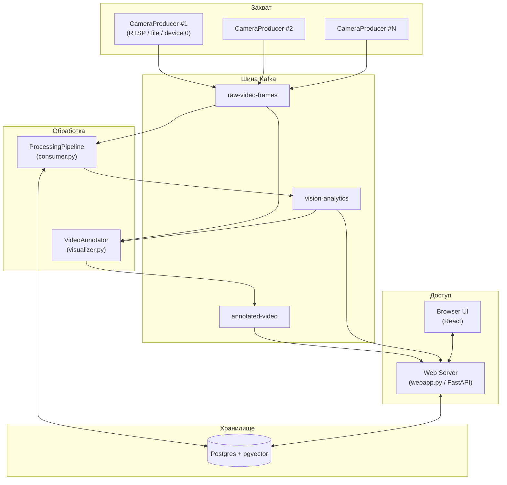
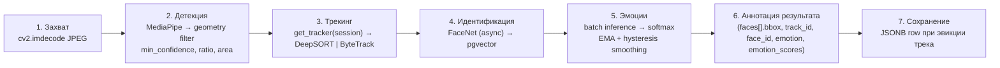
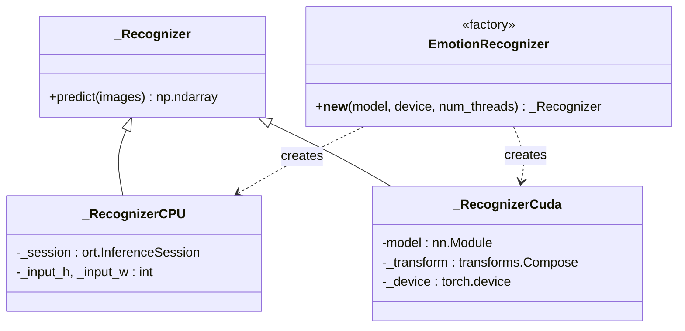
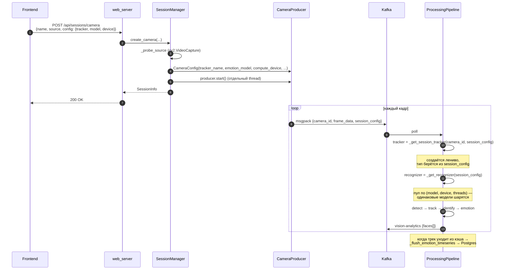
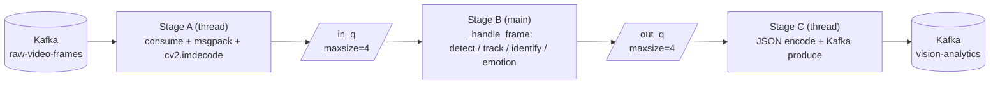
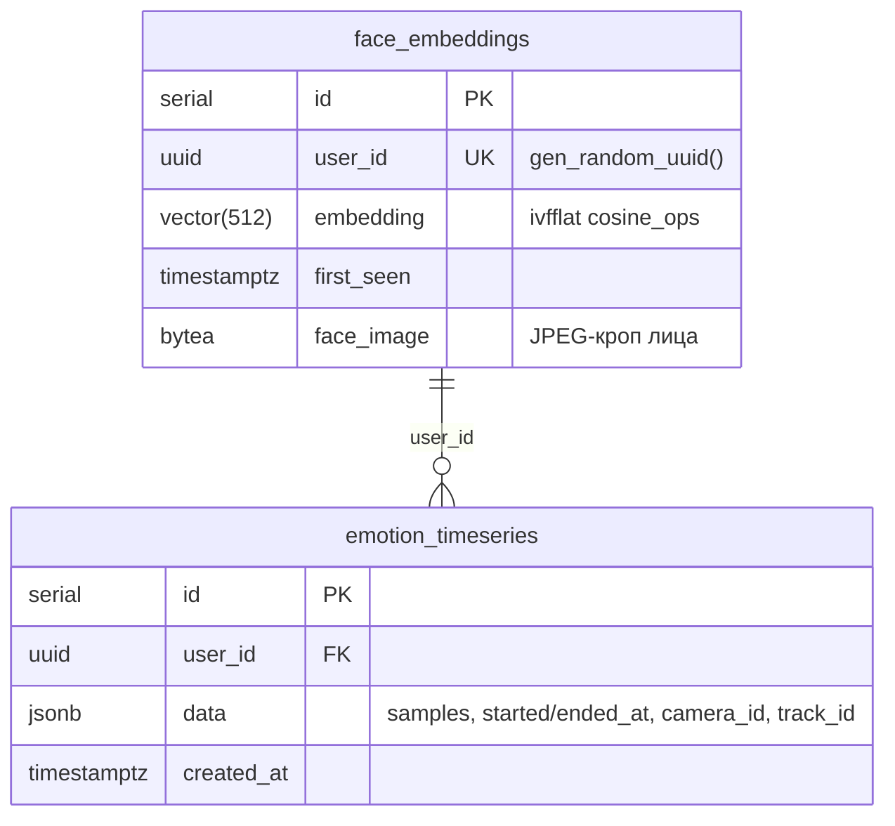

# Архитектура Affectra

Документ описывает архитектуру сервиса по слоям и поясняет принятые
проектные решения. Диаграммы — Mermaid, рендерятся на GitHub и
экспортируются в SVG для тезисной работы.

---

## 1. Слои системы

Affectra — это пять независимых процессов, обменивающихся через Apache
Kafka, и одно общее хранилище состояния (Postgres + pgvector). Такая
декомпозиция даёт три практических свойства:

1. **Изоляция отказов.** Падение аннотатора не останавливает запись
   таймсерий; падение веб-сервера не прерывает обработку.
2. **Произвольная масштабируемость.** Каждую стадию можно вынести на
   отдельный хост, поделить топик по партициям.
3. **Замена алгоритмов без остановки.** Стадии слабо связаны — детектор
   видит только кадр, трекер только bbox-ы, аннотатор только результаты.



Топики Kafka и их роль:

| Топик | Кто пишет | Кто читает | Содержимое |
|---|---|---|---|
| `raw-video-frames` | `CameraProducer` | `ProcessingPipeline`, `VideoAnnotator`, web-server | msgpack: `{camera_id, frame_id, frame_data (JPEG), session_config, ...}` |
| `vision-analytics` | `ProcessingPipeline` | `VideoAnnotator`, web-server (WS-канал) | JSON: `{camera_id, frame_id, faces: [{bbox, track_id, face_id, emotion, emotion_scores}]}` |
| `annotated-video` | `VideoAnnotator` | web-server (MJPEG-эндпоинт) | msgpack: `{camera_id, frame_id, annotated_frame (JPEG с нанесёнными bbox-ами)}` |

---

## 2. Стадии обработки

`ProcessingPipeline._handle_frame` обрабатывает один кадр в пять
последовательных шагов. Каждый шаг — отдельный модуль; контракт между
ними намеренно узкий, что позволило менять алгоритмы без правки
остального кода.



### 2.1. Детекция (`face_detection`)

Используется MediaPipe Face Detection (модель `blaze_face_short_range`).
Кадр предварительно уменьшается до `scale=0.5` для скорости; bbox'ы
масштабируются обратно. Геометрические фильтры отсекают шум:

- `width, height ≥ 40 px`
- `0.75 ≤ height/width ≤ 1.7`
- `0.002 · frame_area ≤ bbox_area ≤ 0.5 · frame_area`

Фильтр `fast_face_filter` дополнительно проверяет, что у изображения
есть достаточная градиентная структура — отсекает однородные ложно-
положительные срабатывания.

### 2.2. Трекинг (`faces_tracking`)

Два алгоритма за общим интерфейсом `_Tracker` (см.
`faces_tracking/tracker.py`):

- **DeepSORT** — Kalman + Re-ID эмбеддер (MobileNet). Лучше через
  перекрытия, но даёт ~10× нагрузку на CPU.
- **ByteTrack** — motion-only, без CNN. На i5-1135G7 в ~3× быстрее.

Для пайплайна каждая сессия (`camera_id`) получает **свой** инстанс
трекера — состояние (Kalman, ID-counter) уникально для сессии.

### 2.3. Идентификация (`face_identification`)

Поток построен с упором на то, что инференс FaceNet и поиск в pgvector
**не должны блокировать стадию B пайплайна**. Алгоритм:

1. Пайплайн встретил новый трек → вставил cached-запись с
   `face_id = "pending-init"` и сразу продолжил.
2. Параллельно отправил задачу в однопоточный `_db_executor` внутри
   `FaceIdentifier`.
3. Воркер считает 512-мерный эмбеддинг (Inception-ResNetV1, веса
   VGGFace2), ищет ближайшего соседа в `face_embeddings` через
   `embedding <=> %s::vector` (cosine). Если similarity ≥ threshold
   (по умолчанию 0.4) — берём существующий UUID; иначе вставляем
   новый.
4. По завершении воркер вызывает `on_resolved(real_id)` — пайплайн
   обновляет `cached["face_id"]` атомарно (GIL гарантирует).

При завершении трека таймсерия эмоций сбрасывается в
`emotion_timeseries` с этим самым `face_id`. Pending-id игнорируются.

### 2.4. Эмоции (`emotion_recognition`)

8 классов: `anger, contempt, disgust, fear, happy, neutral, sad, surprise`.
Шесть архитектур; CPU-инференс через ONNX Runtime, GPU — через PyTorch.



Сглаживание — **EMA + гистерезис** (`pipeline_utils.py`). EMA удерживает
скользящее среднее по вероятностям; гистерезис требует подтверждения
смены лидера N раз подряд, чтобы лента эмоций не «дёргалась».

Эмоции считаются **батчем по всем лицам кадра** — один прогон модели
вместо N последовательных. На сессиях с несколькими лицами даёт
50–80% буст к FPS.

### 2.5. Аннотация и сохранение

После всех стадий пайплайн пишет:

1. В Kafka `vision-analytics` — JSON для аннотатора и WS-канала.
2. В Postgres `emotion_timeseries` — JSONB-блок таймсерии, **только
   когда трек уходит из кэша** (по `_INACTIVITY_TIMEOUT = 5 секунд`),
   с агрегацией всех точек этого трека за время его жизни.

---

## 3. Per-session routing

В одной инсталляции Affectra одновременно могут жить сессии с разными
алгоритмами. Например, веб-камера ресепшна на ByteTrack + ResNet-18 INT8
(быстро, шумно, ID-switch допустимы) и загруженное видео интервью на
DeepSORT + ConvNeXt (точно, ID стабильны).

Конкретный путь конфигурации через систему:



Реализация — в `ProcessingPipeline._get_session_tracker` и
`_get_recognizer`. Стоимость:

- **Трекеры**: лёгкие (Kalman + IoU), память ~1 МБ на сессию.
- **Распознаватели**: тяжёлые (45–110 МБ для FP32), поэтому **шарятся**
  по ключу `(model, device, num_threads)`. Две сессии с одинаковой
  моделью грузят её один раз.

---

## 4. Threaded pipeline (Stage A / B / C)

`ProcessingPipeline.process` запускает три стадии в отдельных потоках,
связанные ограниченными очередями. Это даёт прирост FPS, когда
producer обгоняет процессор: Stage A декодирует следующий кадр, пока
Stage B считает текущий, а Stage C параллельно публикует предыдущий.



**Backpressure** обеспечивается ограниченными очередями: если Stage B
отстаёт, Stage A блокируется на `put`, чтение из Kafka замедляется до
скорости обработки. Без этого память росла бы при медленном Stage B.

Контроль в бенчмарке: `bytetrack_resnet18_t7_seq` (без pipelining) даёт
53 FPS, с pipelining `bytetrack_resnet18_t7` — 48 FPS. На текущем
видео producer не обгоняет процессор, и pipelining добавляет ~5%
overhead. Это нормально и обсуждено в разделе «Оптимизация»: pipelining
включается, когда производитель быстрее потребителя.

---

## 5. Схема Postgres



Индекс `idx_face_embeddings` — IVFFlat с метрикой cosine для поиска
ближайших соседей. При 100+ лицах в базе ускоряет k-NN на порядок.

Запросы — в `db_managing/_faces_db_handler.py` и
`web_server/routes/history.py`.

---

## 6. Frontend

Single-page React 18 приложение, организованное вокруг роутера:

```
/                 — главная (превью активных сессий)
/cameras          — сетка камер (1×1 / 2×2 / 3×3)
/cameras/:id      — фокус камеры
/uploads          — загрузка файлов + сетка
/uploads/:id      — фокус видеофайла
/history          — поиск по фото → top-K похожих
/history/:userId  — детальная история эмоций
/settings         — управление камерами и параметрами
/about            — этика и обзор системы
```

Состояние:
- **REST-поллинг** (`useSessions`, `useUiPrefs`) — каждые 2.5–5 секунд.
- **WebSocket** (`useSessionEvents`) — live-события аналитики (~25 Hz).
- **localStorage** — UI-предпочтения (число похожих лиц при поиске).

Графики (`components/charts/`) — собственные SVG-компоненты без
сторонних библиотек: `EmotionBars`, `EmotionTimeline`,
`EmotionLines` (линии вероятностей), `EmotionAreaChart` (stacked area),
`EmotionRadar` (polar профиль). Сэмплы прорежены до 600 точек для
плавности.

---

## 7. Принятые проектные решения и компромиссы

| Решение | Альтернатива | Аргумент |
|---|---|---|
| Kafka между сервисами | gRPC / HTTP | Декаплинг отказов; уже есть как infra |
| msgpack для кадров | JSON | Бинарные JPEG → msgpack ≈ 2× меньше overhead, чем base64 |
| Stage A/B/C в одном процессе | разные процессы | Сложность networking-а перевешивает выигрыш для текущей нагрузки |
| Сглаживание EMA+гистерезис | argmax-каждый-кадр | Стабильная лента эмоций без флика; pacing setting `emotion_frequency` |
| Per-session lazy spawn | глобальная очередь | Тяжёлые модели грузятся только когда нужны; рекомендации стабильны |
| pgvector | FAISS / Elasticsearch | Один сервис, общая транзакция с face_image |
| ONNX Runtime + XNNPACK | TensorRT | Кроссплатформенно; INT8-выигрыш на VNNI CPU |
| MJPEG для UI | WebRTC / HLS | Простота; `` рендерит нативно; latency ~50 мс ок для демо |

---

## 8. Дальнейшее развитие (упомянуть в work plan)

- Static INT8 quantization с калибровочным датасетом — даст реальный
  выигрыш для свёрточных моделей на VNNI CPU.
- Поддержка TensorRT на GPU.
- Multi-camera fusion: совместный треккинг лиц через несколько камер.
- Аналитика поверх `emotion_timeseries`: тренды, аномалии, групповая
  агрегация настроения.
- Полноценная аутентификация в веб-интерфейсе (сейчас локальная сеть).
