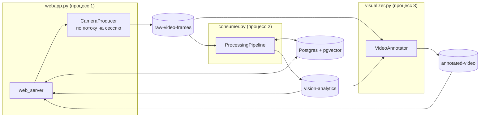
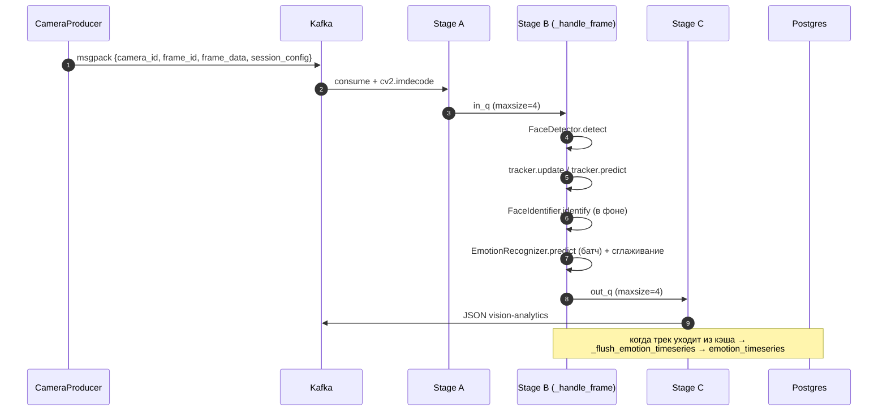

# Обзор кодовой базы Affectra

Документ — «карта» Python-кода: какие есть модули, за что каждый отвечает,
кто кого вызывает и в каком порядке это читать. Подробности по каждому
модулю — в [`docs/modules/`](modules/README.md).

Смежные документы:

- [`README.md`](../README.md) — что это за проект, как запустить, бенчмарки.
- [`docs/ARCHITECTURE.md`](ARCHITECTURE.md) — архитектурные решения и компромиссы.

---

## 1. Четыре процесса и один пакет

Весь Python-код живёт в пакете `src/`, а запускается через четыре тонких
entry point-а в корне репозитория:

| Скрипт | Что поднимает | Модуль |
|---|---|---|
| [`consumer.py`](../consumer.py) | `ProcessingPipeline` — детекция → трекинг → идентификация → эмоции | `src/frames_processing` |
| [`visualizer.py`](../visualizer.py) | `VideoAnnotator` — рисует рамки и подписи на кадрах | `src/video_annotating` |
| [`webapp.py`](../webapp.py) | FastAPI-приложение (uvicorn, порт 8000) | `src/web_server` |
| [`producer.py`](../producer.py) | Ручной запуск одного `CameraProducer` (для отладки) | `src/video_producing` |

В обычном режиме продюсеры создаёт не `producer.py`, а веб-сервер: на
`POST /api/sessions/camera` он поднимает `CameraProducer` в отдельном
потоке своего же процесса.



---

## 2. Структура пакета `src/`

```
src/
├── logging_config.py          — единый setup_logger() для всех сервисов
├── data_models/               — dataclass-описания сообщений (справочные)
├── video_producing/           — захват видео и публикация кадров в Kafka
│   ├── config.py              — CameraConfig (все параметры сессии)
│   └── producer.py            — CameraProducer (поток захвата + отправка)
├── frames_processing/         — основной конвейер обработки кадра
│   ├── kafka_io.py            — тонкая обёртка consumer/producer
│   ├── processing_pipline.py  — ProcessingPipeline: Stage A/B/C, кэш треков
│   └── processing/
│       ├── face_detection/    — MediaPipe + геометрические фильтры
│       ├── faces_tracking/    — DeepSORT / ByteTrack за общим интерфейсом
│       ├── face_identification/ — FaceNet-эмбеддинг + поиск в pgvector
│       └── emotion_recognition/ — модели эмоций (ONNX/PyTorch) + сглаживание
├── video_annotating/          — VideoAnnotator + буферы синхронизации
├── db_managing/               — psycopg2-обёртки над таблицами
└── web_server/                — FastAPI: sessions · uploads · stream · events · history
    ├── routes/                — HTTP/WS-эндпоинты
    └── services/              — менеджер сессий, диспетчеры Kafka→клиент, поиск лиц
```

Вспомогательные скрипты — в [`scripts/`](../scripts) (бенчмарк, квантизация
моделей, диагностика БД).

---

## 3. Путь одного кадра по коду



Ключевые точки входа для чтения кода:

1. [`ProcessingPipeline._handle_frame`](../src/frames_processing/processing_pipline.py) —
   вся логика обработки одного кадра на одном экране.
2. [`ProcessingPipeline.process`](../src/frames_processing/processing_pipline.py) —
   как устроены три стадии и backpressure.
3. [`CameraProducer._process_capture_loop`](../src/video_producing/producer.py) —
   как кадры попадают в Kafka.
4. [`web_server/main.py`](../src/web_server/main.py) — сборка API и жизненный цикл.

---

## 4. Форматы сообщений

### `raw-video-frames` (msgpack, пишет `CameraProducer`)

```python
{
  'camera_id': 'cam_ab12cd',
  'frame_id': '175',
  'timestamp': 1762538732.41,
  'frame_data': b'\xff\xd8...',        # JPEG
  'processed_width': 854, 'processed_height': 480,
  'original_width': 1920, 'original_height': 1080,
  'quality': 60, 'frame_rate': 20, 'format': 'jpeg',
  'session_config': {'tracker': 'bytetrack', 'model': 'resnet-18', 'device': 'cpu'},
}
```

### `vision-analytics` (JSON, пишет `ProcessingPipeline`)

```json
{
  "camera_id": "cam_ab12cd",
  "frame_id": "175",
  "faces": [
    {
      "bbox": [312, 88, 421, 210],
      "track_id": 4,
      "face_id": "3f2a...-uuid | pending-9c1f",
      "emotion": "neutral",
      "emotion_scores": [0.04, 0.03, 0.02, 0.05, 0.81, 0.02, 0.02, 0.01]
    }
  ]
}
```

### `annotated-video` (msgpack, пишет `VideoAnnotator`)

```python
{'camera_id': 'cam_ab12cd', 'frame_id': '175', 'annotated_frame': b'\xff\xd8...'}
```

Порядок вероятностей везде один и тот же —
`EMOTION_LABELS` из [`pipeline_utils.py`](../src/frames_processing/processing/emotion_recognition/pipeline_utils.py):

```
anger, contempt, disgust, fear, happy, neutral, sad, surprise
```

---

## 5. Схема базы данных

```sql
face_embeddings(id, user_id UUID UNIQUE, embedding vector(512),
                first_seen timestamptz, face_image bytea)
emotion_timeseries(id, user_id UUID → face_embeddings.user_id,
                   data JSONB, created_at timestamptz)
```

`data` — один трек целиком:

```json
{
  "camera_id": "upload_8922b7", "track_id": 12,
  "started_at": 1762538732.41, "ended_at": 1762538745.18,
  "samples": [{"t": 1762538733.22, "label": "neutral", "scores": [ ... 8 ... ]}]
}
```

DDL — в [`faces_emotions_database/init.sql`](../faces_emotions_database/init.sql).

---

## 6. Конфигурация через переменные окружения

| Переменная | Кто читает | Default |
|---|---|---|
| `KAFKA_BOOTSTRAP_SERVERS` | `consumer.py`, `visualizer.py` | `localhost:9092` |
| `TOPIC_RAW` / `TOPIC_ANALYTICS` / `TOPIC_ANNOTATED` | `consumer.py`, `visualizer.py` | `raw-video-frames` / `vision-analytics` / `annotated-video` |
| `PIPELINE_GROUP_ID` | `consumer.py` | `emotion-pipeline-v1` |
| `DETECTOR_MIN_CONF` | `consumer.py` | `0.8` |
| `EMOTION_MODEL_DEFAULT` / `EMOTION_DEVICE_DEFAULT` / `EMOTION_NUM_THREADS` | `consumer.py` | `resnet-18` / `cpu` / `4` |
| `TRACKER_DEFAULT` | `consumer.py` | `bytetrack` |
| `DETECTION_FREQUENCY` | `consumer.py` | `1` |
| `IDENTIFIER_THRESHOLD` | `consumer.py` | `0.4` |
| `DB_HOST` / `DB_PORT` / `DB_NAME` / `DB_USER` / `DB_PASSWORD` | `consumer.py` | `localhost` / `5433` / `emotions` / `app_user` / `basic_app_password` |
| `AFFECTRA_KAFKA`, `AFFECTRA_TOPIC_*`, `AFFECTRA_DB_*` | `web_server/config.py` | см. [`config.py`](../src/web_server/config.py) |
| `LOG_LEVEL` | `logging_config.py` | `INFO` |

Шаблон — [`.env.example`](../.env.example); значения для контейнеров —
в [`docker-compose.yml`](../docker-compose.yml).

---

## 7. Соглашения в коде

- **Приватность по подчёркиванию.** `_имя` — внутреннее; наружу модуль
  отдаёт только то, что перечислено в `__all__` его `__init__.py`.
- **Фабрики вместо наследования на местах вызова.** `get_tracker(settings)`,
  `EmotionRecognizer(model, device)`, `get_emotion_smoothing_strategy(name)` —
  алгоритм выбирается строкой из конфига, вызывающий код о реализациях не знает.
- **Тяжёлое — в фоне.** Обращения к БД и FaceNet уходят в
  `ThreadPoolExecutor`; горячий путь кадра их не ждёт.
- **Ограниченные очереди.** Везде, где есть producer/consumer внутри
  процесса, очередь ограничена: либо блокировка (backpressure в пайплайне),
  либо выбрасывание самого старого элемента (стриминг в UI).
- **Логи.** Все сервисы зовут `setup_logger(<имя>)`; в контейнерах формат
  JSON, локально у веб-сервера — цветной текст.
- **Кириллица в докстрингах.** Стиль смешанный (`:param:` и Google-style
  `Args:`) — это осознанно оставлено как есть, чтобы не переписывать
  историю; ориентироваться следует на текст, а не на формат.

---

## 8. С чего начать чтение

| Задача | Куда смотреть |
|---|---|
| Понять систему целиком | [`README.md`](../README.md) → [`ARCHITECTURE.md`](ARCHITECTURE.md) |
| Добавить/заменить алгоритм трекинга | [`modules/faces_tracking.md`](modules/faces_tracking.md) |
| Добавить новую модель эмоций | [`modules/emotion_recognition.md`](modules/emotion_recognition.md) |
| Разобраться, откуда берётся `face_id` | [`modules/face_identification.md`](modules/face_identification.md) |
| Поправить API или добавить эндпоинт | [`modules/web_server.md`](modules/web_server.md) |
| Понять, что и когда пишется в БД | [`modules/db_managing.md`](modules/db_managing.md) |
| Измерить производительность | [`modules/scripts.md`](modules/scripts.md) |
