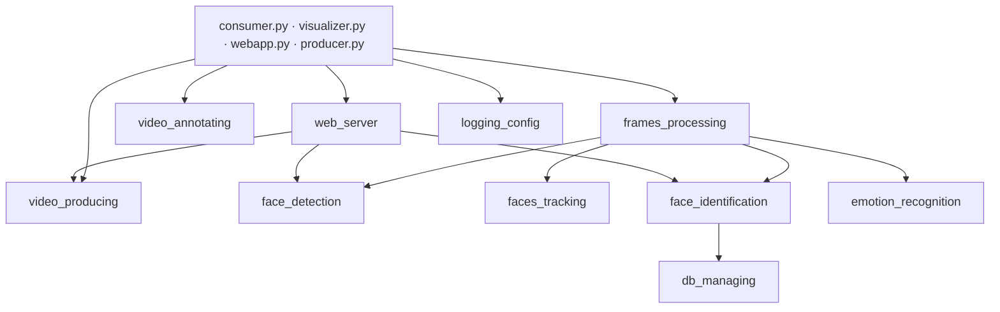

# Документация по модулям

Каждый файл описывает один Python-модуль: назначение, состав, публичный
API, поток данных внутри и особенности, о которые легко споткнуться.

Общая карта кода — [`docs/CODE_OVERVIEW.md`](../CODE_OVERVIEW.md).

| Документ | Модуль / файлы | Роль |
|---|---|---|
| [entrypoints.md](entrypoints.md) | `consumer.py`, `visualizer.py`, `webapp.py`, `producer.py` | Точки входа четырёх сервисов |
| [video_producing.md](video_producing.md) | `src/video_producing/` | Захват видео → JPEG → Kafka |
| [frames_processing.md](frames_processing.md) | `src/frames_processing/` (`processing_pipline.py`, `kafka_io.py`) | Оркестрация обработки кадра, Stage A/B/C |
| [face_detection.md](face_detection.md) | `src/frames_processing/processing/face_detection/` | MediaPipe-детектор + фильтры ложных срабатываний |
| [faces_tracking.md](faces_tracking.md) | `src/frames_processing/processing/faces_tracking/` | DeepSORT и ByteTrack за одним интерфейсом |
| [face_identification.md](face_identification.md) | `src/frames_processing/processing/face_identification/` | FaceNet-эмбеддинг + поиск в pgvector |
| [emotion_recognition.md](emotion_recognition.md) | `src/frames_processing/processing/emotion_recognition/` | Модели эмоций (ONNX/PyTorch), сглаживание |
| [video_annotating.md](video_annotating.md) | `src/video_annotating/` | Синхронизация кадров с аналитикой, отрисовка |
| [db_managing.md](db_managing.md) | `src/db_managing/` | psycopg2-обёртки над `face_embeddings` и `emotion_timeseries` |
| [web_server.md](web_server.md) | `src/web_server/` | FastAPI: сессии, загрузки, MJPEG, WebSocket, история |
| [data_models.md](data_models.md) | `src/data_models/` | Dataclass-описания сообщений |
| [logging_config.md](logging_config.md) | `src/logging_config.py` | Единая настройка логирования |
| [scripts.md](scripts.md) | `scripts/` | Бенчмарк, квантизация моделей, диагностика БД |

## Зависимости между модулями

Обратных зависимостей нет: `db_managing` не знает о пайплайне,
`face_detection` не знает о трекинге, `video_producing` ничего не знает о
`web_server`, хотя и запускается из него.
