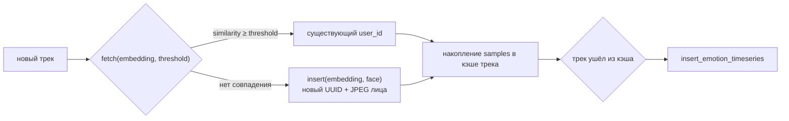

# `src/db_managing` — работа с базой данных

Тонкий слой над psycopg2 для пайплайна: вставка лиц, поиск ближайшего
эмбеддинга и запись таймсерий эмоций.

```
src/db_managing/
├── __init__.py           — экспорт FacesDBHandler
├── _abstract_handler.py  — AbstractDBHandler: подключение и контракт
└── _faces_db_handler.py  — FacesDBHandler: конкретные запросы
```

> Веб-сервер **этот модуль не использует**: у него свой пул соединений
> ([`web_server/services/db.py`](web_server.md)), потому что FastAPI
> обслуживает много параллельных запросов, а здесь достаточно одного
> соединения на однопоточный executor идентификатора.

---

## Схема данных

```sql
CREATE EXTENSION IF NOT EXISTS vector;

CREATE TABLE face_embeddings (
    id         SERIAL PRIMARY KEY,
    user_id    UUID UNIQUE NOT NULL DEFAULT gen_random_uuid(),
    embedding  vector(512),
    first_seen TIMESTAMPTZ DEFAULT NOW(),
    face_image BYTEA NOT NULL
);
CREATE INDEX idx_face_embeddings
    ON face_embeddings USING ivfflat (embedding vector_cosine_ops) WITH (lists = 100);

CREATE TABLE emotion_timeseries (
    id         SERIAL PRIMARY KEY,
    user_id    UUID NOT NULL REFERENCES face_embeddings(user_id) ON DELETE CASCADE,
    data       JSONB NOT NULL,
    created_at TIMESTAMPTZ DEFAULT NOW()
);
CREATE INDEX idx_emotion_user_id ON emotion_timeseries(user_id);
```

DDL применяется при первом старте контейнера Postgres —
[`faces_emotions_database/init.sql`](../../faces_emotions_database/init.sql).

`ON DELETE CASCADE` означает, что удаление лица уносит всю его историю
эмоций — это и есть механизм «удалить данные пользователя».

---

## `AbstractDBHandler` ([_abstract_handler.py](../../src/db_managing/_abstract_handler.py))

Базовый класс: хранит параметры подключения, умеет `connect()` / `close()`
и объявляет абстрактные `insert` / `fetch`.

```python
handler = FacesDBHandler(host='localhost', port=5433, database='emotions',
                         user='app_user', password='basic_app_password')
handler.connect()      # соединение создаётся отдельным вызовом, не в __init__
```

Курсор — `RealDictCursor`, поэтому все строки результата ведут себя как
словари (`row['user_id']`), а не кортежи.

Разделение «конструктор ≠ подключение» позволяет создать объект заранее
(например, в конструкторе `FaceIdentifier`) и подключиться, когда БД
действительно доступна.

---

## `FacesDBHandler` ([_faces_db_handler.py](../../src/db_managing/_faces_db_handler.py))

### `insert(embedding, image) -> str`

Вставляет новое лицо и возвращает сгенерированный `user_id` (UUID
формируется в Python, а не в БД, чтобы вернуть его без второго запроса).
Изображение приводится к `uint8`, кодируется в JPEG через Pillow и
сохраняется в `BYTEA`.

### `fetch(embedding, threshold=0.6) -> str | None`

```sql
SELECT user_id, embedding <=> (%s)::vector AS distance
FROM face_embeddings
ORDER BY distance ASC
```

Берётся первая строка, считается `similarity = 1 - distance`
(косинусная близость) и сравнивается с порогом. Ниже порога → `None`,
что для [`FaceIdentifier`](face_identification.md) означает «новый человек».

### `insert_emotion_timeseries(user_id, payload)`

Пишет один трек целиком в JSONB-колонку:

```json
{
  "camera_id": "cam_ab12cd",
  "track_id": 4,
  "started_at": 1762538732.41,
  "ended_at": 1762538745.18,
  "samples": [{"t": 1762538733.22, "label": "neutral", "scores": [ ... 8 ... ]}]
}
```

При ошибке делается `rollback()` и исключение пробрасывается наверх — иначе
соединение осталось бы в состоянии «failed transaction» и все последующие
запросы падали бы с `InFailedSqlTransaction`.

---

## Что и когда пишется



Одна строка `emotion_timeseries` = один трек = одно непрерывное появление
человека в кадре. Долгий трек даёт одну «толстую» запись с сотнями
сэмплов, а не сотню строк.

---

## Особенности и подводные камни

- **Одно соединение — один поток.** psycopg2-соединение не потокобезопасно;
  поэтому `FaceIdentifier` держит `ThreadPoolExecutor(max_workers=1)` и все
  запросы идут через него.
- **`fetch` без `LIMIT 1`.** Сортировка идёт по всей таблице, а берётся
  первая строка. На сотнях лиц IVFFlat-индекс спасает, но на больших
  объёмах запрос стоит дополнить `LIMIT 1`.
- **IVFFlat требует наполнения.** Индекс с `lists = 100` эффективен, когда
  в таблице заметно больше сотни строк; на пустой базе планировщик всё
  равно выберет seq scan — это нормально.
- **Цвет сохранённого лица.** В `insert` кроп подписывается как `'RGB'`,
  хотя из пайплайна он приходит в BGR, поэтому у JPEG в
  `face_image` каналы R и B поменяны местами. На поиск это не влияет
  (эмбеддинги считаются отдельно), но картинка в истории выглядит
  «синеватой». Исправляется одной строкой `cv2.cvtColor(image,
  cv2.COLOR_BGR2RGB)` перед `Image.fromarray`.
- **`insert` не проверяет дубликаты** — уникальность обеспечивается тем,
  что вызывается он только после неудачного `fetch`.
