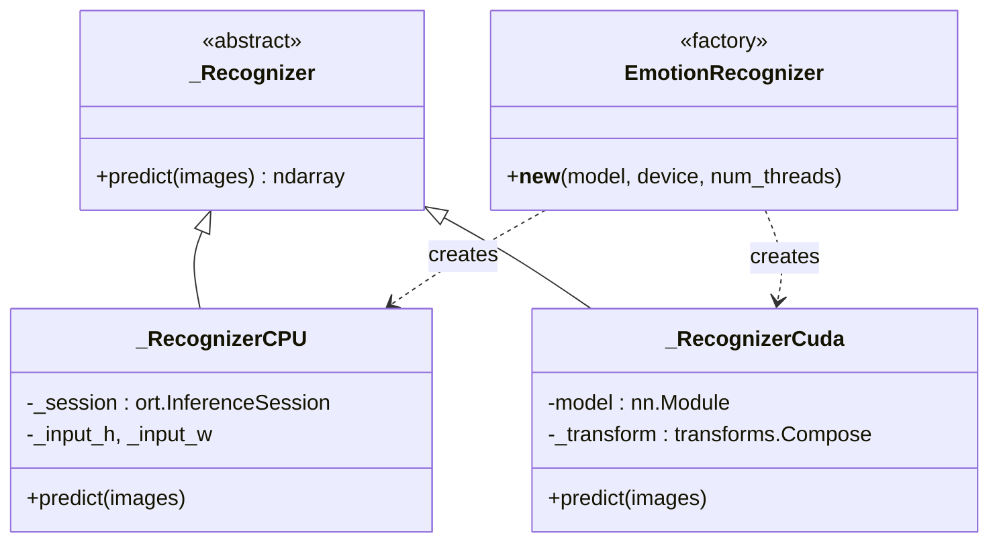

# `emotion_recognition` — распознавание эмоций

Четвёртая стадия: по кропу лица получить распределение вероятностей по
восьми классам и сгладить его во времени, чтобы лента эмоций не «дёргалась».

```
src/frames_processing/processing/emotion_recognition/
├── __init__.py             — экспорт EmotionRecognizer, get_emotion_smoothing_strategy
├── emotion_recognizer.py   — фабрика + CPU (ONNX) и CUDA (PyTorch) реализации
├── pipeline_utils.py       — метки классов и стратегии сглаживания
├── _custom_models.py       — классы моделей для unpickle .pth
└── models/                 — веса: *.onnx, *.int8.onnx, *.pth
```

Классы (порядок фиксирован во всём проекте):

```
0 anger · 1 contempt · 2 disgust · 3 fear · 4 happy · 5 neutral · 6 sad · 7 surprise
```

---

## `EmotionRecognizer` — фабрика ([emotion_recognizer.py](../../src/frames_processing/processing/emotion_recognition/emotion_recognizer.py))

```python
recognizer = EmotionRecognizer(model='resnet-18', device='cpu', num_threads=4)
probs = recognizer.predict([crop1, crop2])   # np.ndarray формы (N, 8)
```

Это класс с переопределённым `__new__`: он **не возвращает свой экземпляр**,
а отдаёт `_RecognizerCPU` или `_RecognizerCuda`. Поэтому `isinstance(x,
EmotionRecognizer)` всегда `False` — проверяйте `_Recognizer`.

### Доступные модели

| Имя модели | CPU (`.onnx`) | CPU INT8 | CUDA (`.pth`) | Вход |
|---|:---:|:---:|:---:|---|
| `resnet-18` | ✅ | ✅ | ✅ | 224 |
| `resnet-50` | ✅ | ✅ | ✅ | 224 |
| `convnext` | ✅ | ✅ | ✅ | 224 |
| `convnext-gelu` | ✅ | — | ✅ | 224 |
| `efficientnet-b3` | ✅ | ✅ | ✅ | 300 |
| `swin-tiny` | ✅ | ✅ | ✅ | 224 |

INT8-варианты выбираются суффиксом: `resnet-18-int8`. Для `device='cuda'`
суффикс не поддерживается — есть только FP32 `.pth`.

Неизвестная пара «модель + устройство» → `ValueError` со списком доступных
имён для этого устройства.



---

## `_RecognizerCPU` — ONNX Runtime

Препроцессинг вручную на NumPy/OpenCV (быстрее, чем torchvision):
`BGR → RGB` → `resize` под вход модели → `/255` → нормализация
ImageNet (`mean=[0.485,0.456,0.406]`, `std=[0.229,0.224,0.225]`) →
транспонирование в `CHW`. Softmax считается тоже вручную, с вычитанием
максимума для численной устойчивости.

Настройка сессии (`_build_cpu_session`):

| Опция | Значение | Почему |
|---|---|---|
| `graph_optimization_level` | `ORT_ENABLE_ALL` | все оффлайн-оптимизации графа |
| `intra_op_num_threads` | `num_threads` или `os.cpu_count() - 1` | оставляем ядро продюсеру и Kafka |
| `inter_op_num_threads` | `1` | параллелизм внутри операторов эффективнее |
| `execution_mode` | `ORT_SEQUENTIAL` | одна модель, ветвлений в графе нет |
| providers (FP32) | `XnnpackExecutionProvider` → `CPUExecutionProvider` | XNNPACK заметно быстрее на свёртках |
| providers (INT8) | только `CPUExecutionProvider` | XNNPACK не поддерживает динамическую квантизацию |

Размер входа читается прямо из ONNX-графа
(`session.get_inputs()[0].shape`), а не из таблицы — если в графе стоит
динамическая ось, берётся 224.

---

## `_RecognizerCuda` — PyTorch

- Загружает **сериализованную модель целиком** (`torch.load(..., weights_only=False)`),
  а не `state_dict`, поэтому нужны классы из `_custom_models.py`.
- Препроцессинг — стандартный `transforms.Compose`
  (`Resize → ToTensor → Normalize`), размер берётся из `_CUDA_INPUT_SIZE`
  (300 для EfficientNet-B3, иначе 224).
- Инференс под `torch.inference_mode()` + `softmax(dim=1)`.
- Если CUDA недоступна — `RuntimeError` с подсказкой использовать `cpu`.

### `_custom_models.py`

`CustomEfficientNetB3` — архитектура, воспроизведённая под сохранённые
веса (backbone заморожен, кастомная голова
`Dropout → Linear(…,512) → ReLU → Dropout → Linear(512, 8)`).

`_register_for_pickle(...)` прописывает класс в модуль `__main__`: модели
обучались в ноутбуке, и pickle ищет класс именно там. Без этого
`torch.load` падает с `AttributeError: Can't get attribute
'CustomEfficientNetB3' on <module '__main__'>`.

---

## Сглаживание ([pipeline_utils.py](../../src/frames_processing/processing/emotion_recognition/pipeline_utils.py))

```python
smooth = get_emotion_smoothing_strategy('ema_hysteresis')
smooth(cached, probs, frequency=5, ema_coef=0.8)
# мутирует cached: emotion_probs, emotion_label, счётчики
```

Все стратегии работают одинаково по интерфейсу: принимают словарь кэша
трека и свежее предсказание, обновляют кэш **на месте**.

| Стратегия | Функция | Поведение |
|---|---|---|
| `ema` | `exponential_smoothing` | Чистая EMA, метка = `argmax` сглаженных вероятностей |
| `ema_voting` | `voting` | EMA + счётчик: метка меняется, когда «сырой» лидер набрал 2 голоса |
| `ema_hysteresis` | `hysteresis_exp_smoothing` | EMA + гистерезис — **используется в пайплайне** |

Эффективный коэффициент — `ema_coef ** frequency`: раз инференс идёт не
каждый кадр, вес истории корректируется на пропущенные кадры.

### Гистерезис подробнее

1. Обновляем `emotion_probs` по EMA.
2. `new_label = argmax(emotion_probs)`.
3. Если `new_label` отличается от текущей **и** уверенность «сырого»
   предсказания `> 0.6` — увеличиваем `emotion_switch_counter`,
   иначе уменьшаем (не ниже нуля).
4. Смена метки происходит, только когда счётчик достиг 2.

Итог: одиночный выброс не переключает эмоцию, а устойчивое изменение
подтверждается за два инференса.

Первый вызов (или несовпадение размерности) инициализирует кэш «как есть»,
без сглаживания.

`idx_to_label(idx)` переводит индекс в строку и логирует ошибку при выходе
за `[0..7]`, возвращая пустую строку.

---

## Как добавить свою модель

1. Положите файл в `models/` (`.onnx` для CPU и/или `.pth` для CUDA).
2. Добавьте пути в `_models_pathes` под ключами `cpu=<имя>` / `cuda=<имя>`.
3. Если вход не 224 — добавьте размер в `_CUDA_INPUT_SIZE` (для CPU размер
   прочитается из графа автоматически).
4. Для `.pth`, сохранённого целиком, — объявите класс архитектуры в
   `_custom_models.py` и зарегистрируйте его через `_register_for_pickle`.
5. Добавьте имя в `_ModelName` и в `EmotionModel` в
   [`web_server/schemas.py`](web_server.md), чтобы модель появилась в UI.

---

## Особенности и подводные камни

- **`_MODELS_DIR` — относительный Windows-путь**
  (`src\frames_processing\...`). Сервисы нужно запускать из корня
  репозитория; в Linux-контейнере этот путь работать не будет — при
  переносе замените на построение пути от `Path(__file__)`.
- **`scripts/quantize_emotion_model.py` покрывает не все INT8-модели.** В
  его `TARGETS` три записи, причём `convnext-int8` там генерируется из
  `convnext_gelu_head.onnx`, а `_models_pathes` ждёт
  `convnext_basic.int8.onnx`. Недостающие файлы можно получить вызовом с
  `--model <файл>.onnx`, который кладёт результат рядом с исходником.
- **INT8 на CPU без VNNI бывает медленнее FP32** — на i5-1135G7 ResNet-INT8
  проседает примерно втрое (см. таблицу бенчмарка в README). Это ожидаемое
  поведение динамической квантизации, а не ошибка сборки.
- **`predict` всегда возвращает 2-D массив** `(N, num_classes)`; для
  одиночного изображения `N == 1`. Пайплайн подаёт список кропов и
  распаковывает построчно.
- **Кропы имеют разный размер** — каждый ресайзится внутри `predict`,
  батч собирается уже из приведённых к одному размеру тензоров.
