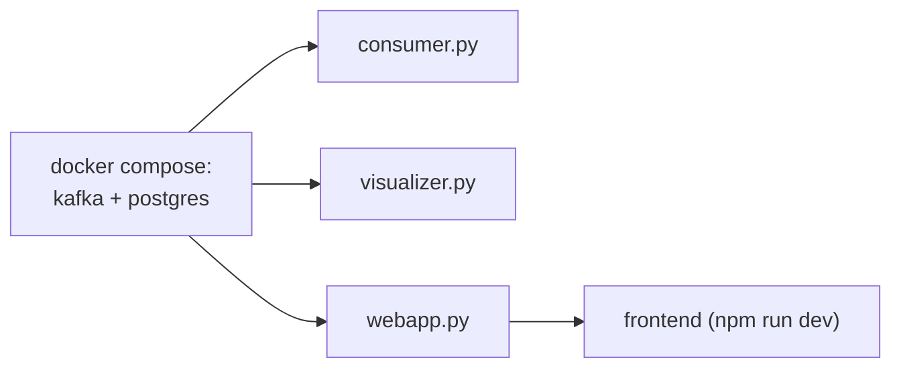

# Точки входа: `consumer.py`, `visualizer.py`, `webapp.py`, `producer.py`

Четыре скрипта в корне репозитория. Все они намеренно тонкие: собирают
настройки (в основном из переменных окружения), создают один объект из
`src/` и передают ему управление. Логика в них не живёт — если хочется
что-то поменять «по-настоящему», это почти всегда правка внутри `src/`.

---

## `consumer.py` — конвейер обработки

Поднимает [`ProcessingPipeline`](frames_processing.md) и вызывает
`pipeline.process()` (блокирующий цикл до `Ctrl+C`).

Собирает пять словарей настроек:

| Словарь | Что настраивает | Ключевые переменные окружения |
|---|---|---|
| `kafka_settings` | адрес брокера, входной/выходной топики, `group_id` | `KAFKA_BOOTSTRAP_SERVERS`, `TOPIC_RAW`, `TOPIC_ANALYTICS`, `PIPELINE_GROUP_ID` |
| `detector_settings` | порог MediaPipe | `DETECTOR_MIN_CONF` (default `0.8`) |
| `analyzer_settings` | модель эмоций по умолчанию, устройство, число ORT-потоков | `EMOTION_MODEL_DEFAULT`, `EMOTION_DEVICE_DEFAULT`, `EMOTION_NUM_THREADS` |
| `identifier_settings` | подключение к Postgres и порог схожести лиц | `DB_HOST`, `DB_PORT`, `DB_NAME`, `DB_USER`, `DB_PASSWORD`, `IDENTIFIER_THRESHOLD` |
| `tracker_settings` | тип трекера + параметры обоих алгоритмов сразу | `TRACKER_DEFAULT` |

`tracker_settings` содержит ключи и DeepSORT (`max_age`, `n_init`,
`nn_budget`, `max_cosine_distance`, `embedder_model_name`), и ByteTrack
(`track_activation_threshold`, `lost_track_buffer`,
`minimum_matching_threshold`, `frame_rate`, `minimum_consecutive_frames`).
Лишние ключи конкретная реализация просто игнорирует — это позволяет
переключать `type` без правки конфига.

Значения из `analyzer_settings` / `tracker_settings` — **дефолты**. Если в
Kafka-сообщении пришёл `session_config` (а веб-сервер его всегда кладёт),
пайплайн для этой сессии использует модель и трекер оттуда.

```bash
python consumer.py
```

---

## `visualizer.py` — аннотатор

Создаёт [`VideoAnnotator`](video_annotating.md) и держит asyncio-loop живым:

```python
annotator = VideoAnnotator(
    ttl_frames=300,          # кадр ждёт свою аннотацию до 300 с
    ttl_annotations=60,      # аннотация ждёт свой кадр до 60 с
    cleanup_interval=5,      # чистка буферов раз в 5 с
    kafka_bootstrap=..., frames_topic=..., annotations_topic=..., output_topic=...,
)
await annotator.run()
```

Переменные окружения: `KAFKA_BOOTSTRAP_SERVERS`, `TOPIC_RAW`,
`TOPIC_ANALYTICS`, `TOPIC_ANNOTATED`.

```bash
python visualizer.py
```

> Нюанс: `KeyboardInterrupt` внутри `asyncio.run` перехватывается не в том
> месте, где стоит `try` (прерывание прилетает из `asyncio.sleep`), поэтому
> `annotator.stop()` при `Ctrl+C` может не успеть отработать. На корректность
> данных это не влияет — Kafka-продюсер аннотатора работает с `acks=0`.

---

## `webapp.py` — веб-сервер

Десять строк: запускает uvicorn с приложением
[`src.web_server.main:app`](web_server.md) на `0.0.0.0:8000`.

```bash
python webapp.py
```

- Swagger: <http://localhost:8000/docs>
- Health: <http://localhost:8000/api/health>

`reload=False` — осознанно: при `reload=True` uvicorn перезапускает процесс
вместе с уже поднятыми `CameraProducer`-ами и Kafka-диспетчерами.

---

## `producer.py` — ручной продюсер (отладочный)

Запускает один [`CameraProducer`](video_producing.md) с захардкоженным
`CameraConfig` (по умолчанию — файл `src\test_videos\film.mp4`) и ждёт
`Enter`, чтобы остановиться.

Нужен, когда надо погонять пайплайн без веб-сервера и фронтенда: например,
при профилировании или отладке новой модели. В штатном сценарии продюсеры
создаёт `SessionManager` внутри `webapp.py`.

```bash
python producer.py
```

> Путь к тестовому видео в файле указан в Windows-нотации и относительно
> корня репозитория — запускать нужно из корня проекта. Каталог
> `src/test_videos/` в репозиторий не коммитится, видео кладётся туда вручную.

---

## Порядок запуска



Строгой зависимости по времени нет — каждый сервис переживает отсутствие
остальных (Kafka-топики создаются автоматически при первой записи), но без
`consumer.py` не будет аналитики, а без `visualizer.py` — картинки в UI.

Всё то же самое одной командой: `docker compose up -d --build`
(см. [`docker-compose.yml`](../../docker-compose.yml)).
