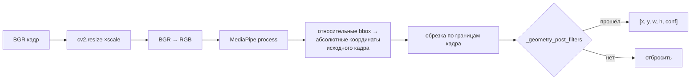

# `face_detection` — детекция лиц

Первая стадия обработки кадра: найти на изображении прямоугольники лиц и
отсеять заведомый мусор до того, как он попадёт в трекинг.

```
src/frames_processing/processing/face_detection/
├── __init__.py         — экспорт FaceDetector, fast_face_filter
├── face_detection.py   — FaceDetector (MediaPipe + геометрия)
└── filters.py          — fast_face_filter, pass_face_filters (градиентные проверки)
```

---

## `FaceDetector` ([face_detection.py](../../src/frames_processing/processing/face_detection/face_detection.py))

Обёртка над `mediapipe.solutions.face_detection` с моделью
`model_selection=0` (BlazeFace short-range — рассчитана на лица в пределах
~2 м от камеры, работает быстрее full-range).

```python
detector = FaceDetector(min_detection_confidence=0.7)
detections = detector.detect(frame, scale=0.5)
# [[x_min, y_min, width, height, confidence], ...]
```

### `__init__(min_detection_confidence=0.7)`

Создаёт MediaPipe-детектор и делает **три прогона по пустому изображению
128×128** — прогрев: первый реальный вызов иначе оказывается в разы
медленнее остальных и портит замеры латентности.

### `detect(image, scale=0.5)`



- `scale=0.5` — детекция идёт по кадру вдвое меньше, координаты
  масштабируются обратно. Основной рычаг производительности этой стадии.
- Возвращаемые координаты — **всегда в системе исходного кадра**.
- Пустое или `None`-изображение → пустой список и warning в лог.

### `_geometry_post_filters(height, width, frame_height, frame_width)`

Отбрасывает bbox, если выполняется хотя бы одно:

| Условие | Зачем |
|---|---|
| `width <= 0 or height <= 0` | вырожденный прямоугольник |
| `width < 40 or height < 40` | слишком мелко для распознавания эмоций |
| `ratio = h/w` вне `[0.75, 1.7]` | лицо не бывает сильно вытянутым/сплюснутым |
| `area < 0.002 · frame_area` или `area > 0.5 · frame_area` | шум или ложное срабатывание на весь кадр |

### `__del__`

Закрывает MediaPipe-граф (`face_detection.close()`) — иначе при пересоздании
детекторов течёт нативная память.

---

## Фильтры ложных срабатываний ([filters.py](../../src/frames_processing/processing/face_detection/filters.py))

Обе функции работают по **чёрно-белому кропу** и отвечают на вопрос
«похоже ли это вообще на лицо» без нейросети. Идея одна: у лица есть
характерная градиентная структура (глаза/брови в верхней половине,
общая неоднородность), у ложного срабатывания на стене или ткани — нет.

### `fast_face_filter(gray, width, height) -> bool`

Используется в пайплайне. Дешёвая аппроксимация оператора Собеля через
разности соседних пикселей:

1. Кроп больше 64 px по стороне ужимается до 64×64.
2. Средний **горизонтальный** градиент верхней половины < 10 → не лицо.
3. Средний **вертикальный** градиент всего кропа < 6 → не лицо.
4. Иначе — лицо.

Вызывается один раз на трек (результат кэшируется в
`ProcessingPipeline._tracks_face_valid`).

### `pass_face_filters(gray, width, height) -> bool`

Более строгий вариант «2 голоса из 3» на сетке 96×96:

| Голос | Проверка |
|---|---|
| 1 | средний горизонтальный градиент верхней половины > 12 |
| 2 | разброс яркости центральной трети ≥ 0.9 × разброса боковых третей |
| 3 | средний вертикальный градиент > 8 |

В текущем пайплайне не задействован — оставлен как более точная (и более
дорогая) альтернатива; сравнение двух фильтров обсуждается в тезисной
работе.

---

## Особенности

- **Порог уверенности задаётся дважды.** `consumer.py` передаёт
  `DETECTOR_MIN_CONF` (default `0.8`), а сервис поиска по фото создаёт свой
  детектор с `0.5` и `scale=1.0` — там важнее найти лицо на одиночном фото,
  чем скорость.
- **MediaPipe не потокобезопасен.** Один `FaceDetection` не следует звать
  из нескольких потоков; в пайплайне детекция всегда происходит в Stage B.
- **Фильтры настроены под 8-битный BGR-кадр** после `cvtColor(..., BGR2GRAY)`;
  подача float-изображения даст бессмысленные пороги.
- Возвращается именно `[x, y, w, h, conf]` (левый верхний угол + размеры) —
  трекеры ждут этот формат, преобразование в `xyxy` делает
  [`faces_tracking`](faces_tracking.md).
