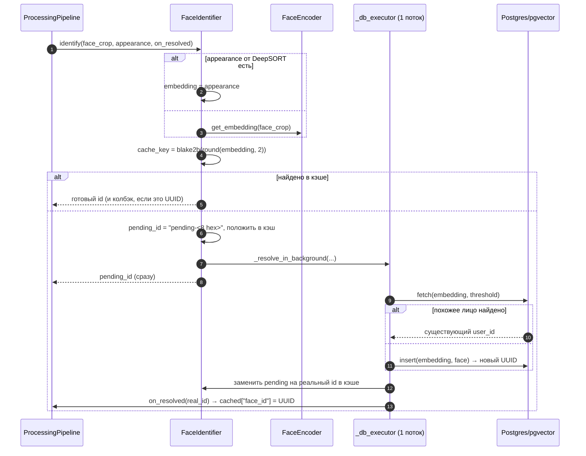

# `face_identification` — идентификация лиц

Третья стадия: сопоставить трек с человеком в базе. На выходе — `user_id`
(UUID), под которым потом сохраняется вся история эмоций.

```
src/frames_processing/processing/face_identification/
├── __init__.py         — экспорт FaceIdentifier
├── _face_encoder.py    — FaceEncoder: лицо → 512-мерный эмбеддинг
└── face_identifier.py  — FaceIdentifier: кэш + фоновый поиск/вставка в pgvector
```

Главная идея модуля: **никогда не блокировать обработку кадра**. Все
обращения к нейросети и к БД уходят в фоновый поток, а вызывающему коду
сразу возвращается временный `pending-...` идентификатор.

---

## `FaceEncoder` ([_face_encoder.py](../../src/frames_processing/processing/face_identification/_face_encoder.py))

```python
encoder = FaceEncoder(warmup=True)
embedding = encoder.get_embedding(face_crop)   # np.ndarray, 512 значений
```

- Модель — `facenet_pytorch.InceptionResnetV1(pretrained='vggface2')` в
  режиме `eval()`, автоматически на CUDA, если она доступна.
- `torch.set_num_threads(1)` и `set_num_interop_threads(1)` — энкодер живёт
  в фоновом потоке и не должен конкурировать за ядра с ONNX-инференсом
  эмоций.
- `_warmup()` — два прогона по нулевому изображению 160×160, чтобы первый
  реальный вызов не выбивался по времени.
- Препроцессинг внутри `get_embedding`: `HWC → CHW`, нормализация
  `(x - 127.5) / 128.0`. Ресайз до 160×160 **не выполняется** — его делает
  вызывающий код (см. `FaceSearch` в [web_server](web_server.md)).

---

## `FaceIdentifier` ([face_identifier.py](../../src/frames_processing/processing/face_identification/face_identifier.py))

### Конструктор

```python
FaceIdentifier(
    host='localhost', port=5433, database='emotions',
    user='app_user', password='basic_app_password',
    threshold=0.6,        # порог косинусной схожести
    cache_ttl=30,         # секунд живёт запись в кэше
    cleanup_interaval=10, # чистка кэша раз в N вызовов identify()
)
```

Создаёт [`FacesDBHandler`](db_managing.md), сразу подключается к Postgres,
поднимает `FaceEncoder` и **однопоточный** `ThreadPoolExecutor`
(`max_workers=1`) — соединение psycopg2 нельзя делить между потоками,
поэтому все запросы сериализуются через один воркер.

### `identify(face, appearence=None, on_resolved=None) -> str`



- `appearence` (sic — опечатка в сигнатуре сохранена) позволяет переиспользовать
  Re-ID эмбеддинг DeepSORT и вообще не гонять FaceNet. С ByteTrack этот
  параметр всегда `None`.
- Возвращаемое значение — либо UUID из БД, либо `pending-xxxxxxxx`.
- Раз в `cleanup_interaval` вызовов делается `_cleanup()` — удаление
  просроченных записей кэша.

### Кэш первого уровня

| Метод | Роль |
|---|---|
| `_create_cache_key(embedding)` | `blake2b(np.round(embedding, 2).tobytes(), digest_size=16)` — округление до 2 знаков склеивает близкие эмбеддинги одного лица в один ключ |
| `_cache_get(key)` | значение, если не истёк TTL |
| `_cache_set(key, face_id)` | запись с `expire = now + cache_ttl` |
| `_cache_update_pending(key, pending_id, real_id)` | заменяет временный id на настоящий |
| `_cleanup()` | удаляет просроченные записи |

Кэш защищён `threading.Lock`, потому что читается из Stage B, а пишется из
фонового воркера.

### `resolve(face_id, face, appearance=None) -> str`

Повторная попытка «дорезолвить» pending-id: считает эмбеддинг, смотрит
кэш и возвращает UUID, если тот уже появился. В текущем пайплайне не
используется (его роль выполняет колбэк `on_resolved`), но полезен для
кода, которому колбэк неудобен.

### `submit_emotion_timeseries(face_id, payload)`

Планирует запись таймсерии в тот же однопоточный executor. Пропускает
запись, если:

- `face_id` пустой или начинается с `pending-` — внешний ключ на
  `face_embeddings` требует существующий UUID;
- в payload нет `samples`.

### `close()` / `__del__`

`shutdown(wait=True)` executor-а, закрытие соединения с БД, очистка кэша.
Вызывается деструктором — при отладке помните, что сборщик мусора закроет
соединение вместе с объектом.

---

## Порог схожести

`fetch` в [`FacesDBHandler`](db_managing.md) считает `similarity = 1 - distance`,
где `distance` — косинусное расстояние pgvector (`<=>`).

| Значение | Поведение |
|---|---|
| `threshold` выше (напр. `0.6`) | строже: один и тот же человек чаще получает новые UUID |
| `threshold` ниже (напр. `0.4`, как в `consumer.py`) | мягче: разные люди рискуют слиться в один UUID |

`0.4` в `consumer.py` подобрано опытным путём под сочетание «кроп из
видеопотока + VGGFace2»: кропы низкого качества дают заметно меньшую
схожесть, чем студийные фото.

---

## Особенности и подводные камни

- **Два источника эмбеддингов несовместимы между собой.** Re-ID эмбеддинг
  DeepSORT и эмбеддинг FaceNet живут в разных пространствах, но
  складываются в одну колонку `embedding vector(512)`. Смешивать трекеры на
  одной базе не следует — иначе поиск по фото (он всегда использует FaceNet)
  не найдёт записи, созданные из DeepSORT-эмбеддингов.
- **Кроп передаётся в BGR.** И `identify`, и `FaceSearch` работают с BGR —
  главное, что порядок каналов одинаков при вставке и при поиске.
- **`pending-` живут недолго, но существуют.** В `vision-analytics` (и,
  значит, в WebSocket-событиях UI) первые кадры трека уходят именно с
  pending-id. Фронтенд обязан быть к этому готов.
- **Одно соединение на весь модуль.** Все запросы идут через
  `max_workers=1`: если БД тормозит, очередь фоновых задач растёт, но
  обработка кадров не останавливается.
