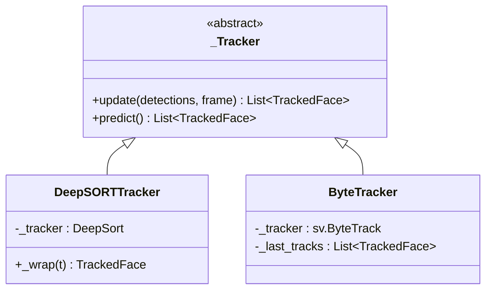

# `faces_tracking` — трекинг лиц

Вторая стадия: связать детекции соседних кадров в треки, чтобы одно и то же
лицо получало стабильный `track_id`, а история эмоций накапливалась по
человеку, а не по кадру.

```
src/frames_processing/processing/faces_tracking/
├── __init__.py         — витрина модуля
├── tracked_face.py     — TrackedFace: единый формат трека
├── tracking_utils.py   — инициализация библиотек + конвертеры координат
└── tracker.py          — _Tracker (ABC), DeepSORTTracker, ByteTracker, get_tracker
```

---

## Общий интерфейс `_Tracker` ([tracker.py](../../src/frames_processing/processing/faces_tracking/tracker.py))

```python
class _Tracker(ABC):
    def update(self, detections: List, frame: np.ndarray) -> List[TrackedFace]: ...
    def predict(self) -> List[TrackedFace]: ...
```

- `update(detections, frame)` — шаг с новыми детекциями (`[x, y, w, h, conf]`).
- `predict()` — шаг без детекций: используется, когда кадр пропущен по
  `detection_frequency`.

Обе реализации возвращают список `TrackedFace`, поэтому пайплайн не знает,
какой алгоритм внутри.



---

## `TrackedFace` ([tracked_face.py](../../src/frames_processing/processing/faces_tracking/tracked_face.py))

Лёгкий контейнер (`__slots__`) с координатами в формате
`xyxy = (left, top, right, bottom)`.

| Поле / метод | Описание |
|---|---|
| `track_id: int` | Идентификатор трека внутри сессии |
| `hits: int` | Сколько раз трек подтверждён (default `3`) |
| `time_since_update: int` | Кадров без обновления |
| `last_feature: np.ndarray?` | Re-ID эмбеддинг (только DeepSORT) |
| `is_confirmed()` | Всегда `True` — фильтрация уже выполнена в обёртке |
| `to_ltrb()` | `(x1, y1, x2, y2)` или `None`, если координаты не конечны/вырождены |
| `to_xywh()` | `(x, y, w, h)` |

Формат `to_ltrb()` совпадает с API `deep-sort-realtime`, поэтому
`represent_ltrb(track)` из пайплайна работает с обоими трекерами.

---

## `DeepSORTTracker`

Обёртка над `deep_sort_realtime.DeepSort`: Kalman-фильтр + Re-ID эмбеддер
(MobileNet по умолчанию). Отдаёт `last_feature`, который
[`FaceIdentifier`](face_identification.md) может использовать вместо
собственного прогона FaceNet.

- `update` → `update_tracks(...)`, оставляет только
  `is_confirmed() and time_since_update == 0`.
- `predict` → дёргает `tracker.tracker.predict()` и отдаёт те же треки.

Параметры (`initialize_deepsort` в
[tracking_utils.py](../../src/frames_processing/processing/faces_tracking/tracking_utils.py)):

| Ключ | Default | Смысл |
|---|---|---|
| `max_age` | `70` | сколько кадров трек живёт без детекций |
| `n_init` | `5` | подтверждений до «боевого» статуса |
| `nn_budget` | `100` | размер галереи эмбеддингов на трек |
| `max_cosine_distance` | `0.3` | порог сопоставления по внешности |
| `embedder_model_name` | `'mobilenet'` | сеть Re-ID |
| `embedder_gpu` | `False` | инференс эмбеддера на GPU |

**Цена:** на i5-1135G7 конфигурация с DeepSORT даёт ~17 FPS против ~48 FPS
с ByteTrack и примерно вдвое больший прирост RSS (см. бенчмарк в README).

---

## `ByteTracker`

Обёртка над `supervision.ByteTrack` — сопоставление только по движению
(IoU + Kalman), без CNN. Быстрее в ~3 раза, но `last_feature` всегда `None`,
поэтому идентификация опирается на прогон FaceNet по кропу лица.

- `update` конвертирует детекции в `sv.Detections(xyxy, confidence, class_id)`
  и запоминает результат в `_last_tracks`.
- `predict` возвращает те же `_last_tracks`, увеличив `time_since_update`.
  Пайплайн пропускает треки с `time_since_update > 0`, то есть на кадрах без
  детекций ByteTrack фактически не даёт новых лиц — это осознанный компромисс.

Параметры (`initialize_bytetrack`):

| Ключ | Default | Смысл |
|---|---|---|
| `track_activation_threshold` | `0.25` | порог уверенности детекции |
| `lost_track_buffer` | `30` | кадров хранить потерянный трек |
| `minimum_matching_threshold` | `0.8` | порог IoU-сопоставления |
| `frame_rate` | `20` | ожидаемый FPS (влияет на модель движения) |
| `minimum_consecutive_frames` | `3` | подтверждений до выдачи трека |

---

## Фабрика `get_tracker(settings)`

```python
tracker = get_tracker({"type": "bytetrack", "lost_track_buffer": 30, ...})
```

Реестр имён (регистр не важен):

| `type` | Класс |
|---|---|
| `deepsort`, `deep_sort` | `DeepSORTTracker` |
| `bytetrack`, `byte_track`, `byte` | `ByteTracker` |

Неизвестное значение → `ValueError` со списком доступных. По умолчанию —
`deepsort`. Лишние ключи настроек игнорируются, поэтому один словарь может
содержать параметры обоих алгоритмов (так и сделано в `consumer.py`).

---

## Конвертеры ([tracking_utils.py](../../src/frames_processing/processing/faces_tracking/tracking_utils.py))

| Функция | Назначение |
|---|---|
| `represent_ltrb(track)` | `to_ltrb()` → `(x, y, w, h)` в `int`, с проверками на `NaN/inf` и вырожденность; `None`, если трек невалиден |
| `represent_detections(detections)` | `[x, y, w, h, conf]` → формат DeepSORT `[[x, y, w, h], conf, 'face']`; попутно отбрасывает записи с `conf <= 0.3` и нулевыми размерами |

---

## Как добавить свой трекер

1. Наследуйтесь от `_Tracker`, реализуйте `update` и `predict`, возвращая
   `List[TrackedFace]`.
2. Зарегистрируйте класс в `_TRACKER_REGISTRY`.
3. При необходимости добавьте имя в `TrackerName` в
   [`web_server/schemas.py`](web_server.md) — тогда трекер станет доступен
   в UI и уедет в `session_config`.

Пайплайн менять не нужно: `_get_session_tracker` создаёт трекер по строке
из конфига сессии.

---

## Особенности

- **Трекер — на сессию, не на процесс.** Kalman-состояние и счётчик ID
  уникальны для `camera_id`; при завершении сессии трекер удаляется
  (`_evict_session`).
- **`track_id` не уникален глобально.** Два потока начнут нумерацию с
  единицы. Уникальным идентификатором человека является `face_id` (UUID из
  БД), а ключом трека — пара `(camera_id, track_id)`.
- **`is_confirmed()` всегда True.** Проверка в пайплайне
  (`if not track.is_confirmed()`) оставлена для совместимости с «сырыми»
  треками DeepSORT и ничего не отсекает для `TrackedFace`.
