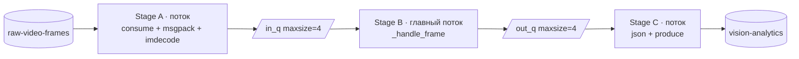
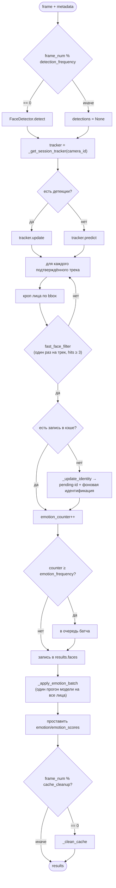
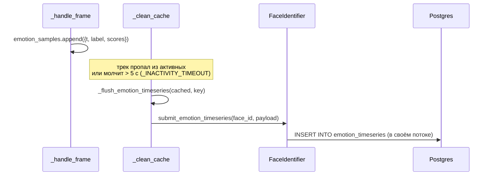

# `src/frames_processing` — конвейер обработки кадров

Центральный модуль проекта. Читает кадры из Kafka, прогоняет их через
четыре стадии компьютерного зрения, публикует результат и складывает
таймсерии эмоций в Postgres.

```
src/frames_processing/
├── kafka_io.py            — KafkaIO: consume/produce/close
├── processing_pipline.py  — ProcessingPipeline (оркестратор)
└── processing/            — сами алгоритмы (см. отдельные документы)
    ├── face_detection/        → face_detection.md
    ├── faces_tracking/        → faces_tracking.md
    ├── face_identification/   → face_identification.md
    └── emotion_recognition/   → emotion_recognition.md
```

`processing/__init__.py` — единая витрина: пайплайн импортирует всё
(`FaceDetector`, `get_tracker`, `FaceIdentifier`, `EmotionRecognizer`,
`represent_ltrb`, `fast_face_filter`, `get_emotion_smoothing_strategy`)
одной строкой и не знает о внутренней структуре подпакетов.

---

## `KafkaIO` ([kafka_io.py](../../src/frames_processing/kafka_io.py))

Тонкая обёртка над `confluent_kafka`, чтобы пайплайн не занимался
конфигурацией брокера.

| Метод | Поведение |
|---|---|
| `consume(timeout=1.0)` | `poll` одного сообщения; `None` при таймауте или ошибке (ошибка логируется) |
| `produce(result: dict)` | Кладёт `json.dumps(result)` в выходной топик, ключ — `camera_id`. `BufferError` → warning и потеря сообщения |
| `close(flush_timeout=3.0)` | `flush` продюсера + `consumer.close()` |

Consumer читает с `auto.offset.reset='latest'` — при рестарте пайплайн не
догоняет накопившиеся старые кадры, а работает «с живого места».

`close()` важен: без него librdkafka держит фоновые потоки, и процесс после
`Ctrl+C` на Windows не завершается.

---

## `ProcessingPipeline` ([processing_pipline.py](../../src/frames_processing/processing_pipline.py))

### Конструктор

```python
ProcessingPipeline(
    kafka_settings, detector_settings, analyzer_settings,
    tracker_settings, identifier_settings,
    emotion_frequency=5,      # инференс эмоций раз в N кадров трека
    cache_cleanup=10,         # чистка кэша треков раз в N кадров
    exp_smoothing_coef=0.8,   # коэффициент EMA
    detection_frequency=1,    # детекция раз в N кадров
)
```

Создаёт по одному экземпляру `KafkaIO`, `FaceDetector`, `EmotionRecognizer`,
трекера и `FaceIdentifier`, плюс два per-session реестра и пул потоков
идентификации (`max_workers=2`).

### Три стадии (`process`)



- Очереди ограничены → **backpressure**: если Stage B не успевает, Stage A
  блокируется на `put` и чтение из Kafka замедляется, а не растит память.
- Завершение: `stop.set()` → Stage A кладёт `None` в `in_q`, главный цикл
  выходит, `None` в `out_q` останавливает Stage C. В `finally` таймсерии
  всех живых треков сбрасываются в БД, executor и Kafka закрываются.
- Раз в 100 кадров в лог уходит FPS и заполненность обеих очередей — самый
  быстрый способ понять, какая стадия является узким местом.
- Если `in_q` пуста дольше 2 с, вызывается «холостая» чистка кэша
  `_clean_cache([], "")` — так завершившиеся сессии дописывают свои
  таймсерии, даже когда новые кадры по их `camera_id` больше не приходят.

### `_handle_frame` — обработка одного кадра



Важные детали:

- **Кэш треков** `_cached_faces[(camera_id, track_id)]` хранит: `face_id`,
  сглаженные вероятности `emotion_probs`, текущую метку `emotion_label`,
  счётчики, накопленные `emotion_samples`, `started_at`, `last_seen`.
- **`_tracks_face_valid`** — результат `fast_face_filter` считается один раз
  на трек и кэшируется: фильтр дешёвый, но не бесплатный, а решение
  «это лицо / это не лицо» для стабильного трека не меняется.
- **Трек моложе трёх хитов** (`track.hits < 3`) пропускается — отсеивает
  мигающие ложные срабатывания детектора.
- **Эмоции считаются батчем** по всем лицам кадра: один прогон модели
  вместо N. На кадрах с несколькими лицами это +50–80 % к FPS.
- **`emotion_scores` в результате** — сглаженные вероятности из кэша, а не
  «сырой» выход модели.

### Per-session routing

| Метод | Что делает |
|---|---|
| `_recognizer_key(session_config)` | Ключ пула — кортеж `(model, device, num_threads)` |
| `_get_recognizer(session_config)` | Возвращает распознаватель из пула, создаёт при первом обращении. **Модели шарятся** между сессиями с одинаковым ключом (они весят 45–110 МБ) |
| `_get_session_tracker(camera_id, session_config)` | Трекер **свой на каждую сессию** (Kalman-состояние и счётчик ID уникальны), тип берётся из `session_config['tracker']` |
| `_evict_session(camera_id)` | Удаляет трекер сессии, когда в кэше не осталось её треков |

### Запись таймсерий эмоций



`_clean_cache` эвиктит запись в двух случаях: трека нет среди активных для
этой камеры, либо он не обновлялся дольше `_INACTIVITY_TIMEOUT = 5.0` с.
Второе условие ловит завершившиеся сессии.

Если к моменту сброса `face_id` всё ещё `pending-...`, запись **молча
пропускается**: внешний ключ на `face_embeddings` требует существующий
UUID. На практике идентификация укладывается в первые секунды трека.

### Асинхронная идентификация

`_update_identity` создаёт запись кэша с `face_id="pending-init"` и сразу
возвращает управление, а `_fill_identity_async` в фоне зовёт
`FaceIdentifier.identify(...)` с колбэком `on_resolved`, который заменяет
`cached["face_id"]` на настоящий UUID. Присваивание поля словаря атомарно
под GIL, поэтому дополнительной блокировки не нужно.

---

## Параметры и их влияние

| Параметр | Смысл | Эффект при увеличении |
|---|---|---|
| `detection_frequency` | детекция раз в N кадров | быстрее, но треки дольше живут «на предсказании» |
| `emotion_frequency` | инференс эмоций раз в N кадров трека | заметно быстрее; лента эмоций реже обновляется |
| `exp_smoothing_coef` | вес истории в EMA | плавнее, но медленнее реагирует на смену эмоции |
| `cache_cleanup` | чистка кэша раз в N кадров | реже накладные расходы; таймсерии пишутся с задержкой |
| `_INACTIVITY_TIMEOUT` | 5 с молчания трека до эвикции | константа класса, не параметр конструктора |

---

## Особенности

- **`_frame_num` обнуляется** внутри `_clean_cache`-ветки, поэтому это не
  сквозной счётчик кадров, а счётчик до ближайшей чистки; для метрик
  используйте `frame_count` из `process()`.
- **Трекеры возвращают разные объекты.** DeepSORT-обёртка и ByteTrack
  приводятся к общему `TrackedFace`, у которого `is_confirmed()` всегда
  `True` — фильтрация уже сделана внутри обёрток.
- **Опечатка в имени файла** (`processing_pipline.py`) сохранена намеренно:
  переименование ломает импорты в скриптах и бенчмарке.
- **Бенчмарк дергает приватные методы** (`_handle_frame`, `_cached_faces`) —
  об этом стоит помнить при рефакторинге, см. [scripts.md](scripts.md).
