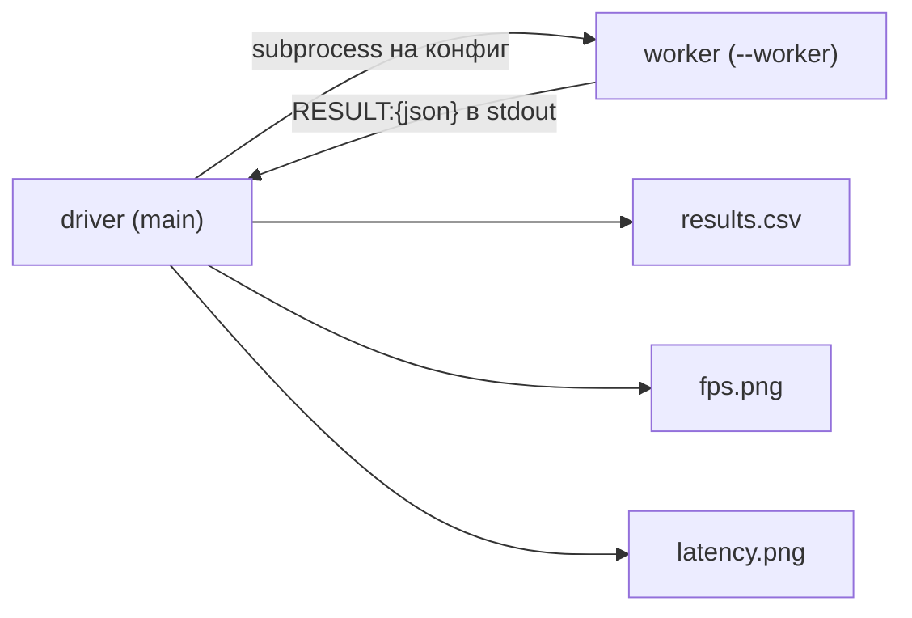

# `scripts/` — вспомогательные скрипты

Три самостоятельных скрипта: измерение производительности, подготовка
INT8-моделей и диагностика того, что реально попало в базу. Все запускаются
из **корня репозитория**.

```
scripts/
├── benchmark.py                — свип конфигураций пайплайна, CSV + графики
├── quantize_emotion_model.py   — динамическая INT8-квантизация ONNX-моделей
├── check_emotion_timeseries.py — что лежит в emotion_timeseries
└── bench_results/              — results.csv, fps.png, latency.png
```

---

## `benchmark.py`

Гоняет один и тот же видеофайл через набор конфигураций
(трекер × модель × число ORT-потоков × pipelining) и считает FPS, латентность
по перцентилям и прирост RSS.

```bash
python scripts/benchmark.py
python scripts/benchmark.py --video src/test_videos/film.mp4 --frames 400 --warmup 30
python scripts/benchmark.py --configs bytetrack_resnet18_t7 bytetrack_swin_int8
```

Перед запуском должны быть подняты Kafka и Postgres — пайплайн создаёт
`KafkaIO` и `FaceIdentifier` даже в режиме прямого вызова `_handle_frame`.

### Устройство



Каждая конфигурация выполняется в **отдельном процессе**: так память
одной модели не перетекает в замеры следующей, а `delta_rss_mb` остаётся
осмысленным. Драйвер читает последнюю строку `RESULT:` из stdout, игнорируя
логи прогрева.

Внутри воркера:

1. Создаётся `ProcessingPipeline` с нужным конфигом.
2. `warmup` кадров прогоняются через `_handle_frame` (прогрев кэшей и JIT).
3. Состояние сбрасывается (`_cached_faces`, `_tracks_face_valid`,
   `_frame_num`), видео перематывается в начало, фиксируется `baseline_rss`.
4. Измеряются `n_frames` кадров: время каждого кадра в мс, RSS каждые
   20 кадров.
5. Таймсерии дописываются в БД, Kafka и executor закрываются.

Обратите внимание: измеряется **только Stage B** (`_handle_frame`), без
Kafka-ввода/вывода. Флаг `threaded` в `Config` попадает в отчёт как
метка конфигурации, а не переключает режим работы воркера.

### Конфигурации (`DEFAULT_CONFIGS`)

| Группа | Конфигурации |
|---|---|
| Сравнение трекеров | `deepsort_resnet18_t7`, `bytetrack_resnet18_t7`, `bytetrack_resnet18_t2` |
| Семейство моделей | `bytetrack_resnet50`, `bytetrack_effnetb3`, `bytetrack_convnext`, `bytetrack_convnext_gelu`, `bytetrack_swin` и их `_int8`-варианты |
| Контроль pipelining | `bytetrack_resnet18_t7_seq` |

### Результаты

`scripts/bench_results/results.csv` — все метрики; `fps.png` и `latency.png`
рисуются matplotlib-ом (если он не установлен, скрипт просто пропустит
графики). Метрики: `fps`, `mean_ms`, `p50_ms`, `p95_ms`, `p99_ms`,
`delta_rss_mb`, `frames`.

Актуальные цифры и их разбор — в [README §6](../../README.md).

---

## `quantize_emotion_model.py`

Создаёт INT8-версии ONNX-моделей эмоций через
`onnxruntime.quantization.quantize_dynamic` — без калибровочного датасета:
веса переводятся в INT8, активации квантуются динамически.

```bash
python scripts/quantize_emotion_model.py                    # все цели из TARGETS
python scripts/quantize_emotion_model.py --model resnet_18.onnx
python scripts/quantize_emotion_model.py --qtype int8       # по умолчанию uint8
```

- Результат кладётся рядом с исходником как `<name>.int8.onnx`.
- Существующий файл не перезаписывается («delete to re-quantize»).
- `QUInt8` по умолчанию: на x86 без VNNI это быстрее `QInt8` (нет лишних
  преобразований знака в `VPMADDUBSW`).
- Потери точности на 8 классах обычно < 1–2 % top-1.

> `TARGETS` в скрипте покрывает три модели и не совпадает с таблицей
> `_models_pathes` в [`emotion_recognizer.py`](emotion_recognition.md):
> `convnext-int8` там генерируется из `convnext_gelu_head.onnx`, а
> распознаватель ждёт `convnext_basic.int8.onnx`. Для остальных INT8-моделей
> используйте форму `--model <файл>.onnx`.

---

## `check_emotion_timeseries.py`

Диагностика: показывает, что реально записалось в `emotion_timeseries`.
Только читает, ничего не меняет.

```bash
python scripts/check_emotion_timeseries.py
python scripts/check_emotion_timeseries.py --limit 3 --samples
python scripts/check_emotion_timeseries.py --user a3f1...
```

Выводит:

1. Сводку — число строк, уникальных пользователей, суммарное число сэмплов.
2. Последние N записей: пользователь, камера, трек, длительность,
   количество сэмплов, доминирующая эмоция и распределение меток
   (с `--samples` — первые три сэмпла с их top-score).
3. Распределение всех меток по базе целиком.

Если таблица пуста, скрипт прямо подсказывает: запустить пайплайн и
дождаться, пока трек уйдёт из кэша — запись появляется только по завершении
трека.

> Параметры подключения захардкожены в словаре `DB` в начале файла
> (`localhost:5433`, `emotions`/`app_user`). При других настройках
> отредактируйте их прямо в скрипте.
