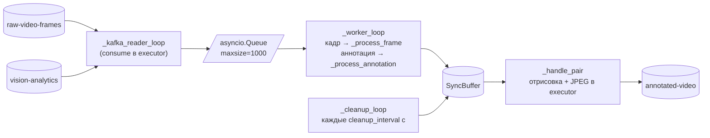

# `src/video_annotating` — аннотация кадров

Отдельный сервис ([`visualizer.py`](entrypoints.md)), который соединяет два
независимых потока Kafka — «сырые кадры» и «результаты аналитики» — и
выдаёт готовые JPEG с нарисованными рамками и подписями для показа в UI.

```
src/video_annotating/
├── buffers.py          — TTLBuffer, SyncBuffer (синхронизация по frame_id)
└── video_annotator.py  — VideoAnnotator (asyncio + Kafka + отрисовка)
```

Почему это отдельный сервис: кадр и его аналитика приходят в разное время
(аналитика позже на время обработки) и из разных топиков. Их надо
буферизовать и склеивать, а падение отрисовки не должно останавливать
запись эмоций в БД.

---

## Буферы ([buffers.py](../../src/video_annotating/buffers.py))

### `TTLBuffer(ttl, *, buffer_name="")`

`OrderedDict` с временем жизни: каждый элемент хранится как
`(timestamp, value)`.

| Метод | Поведение |
|---|---|
| `insert(key, value)` | Кладёт с текущим временем и переносит в конец — порядок вставки сохраняется |
| `get(key)` / `delete(key)` | Значение (без метки времени) или `None` |
| `cleanup()` | Удаляет протухшие **с головы**, останавливаясь на первом живом |
| `key in buffer` | Проверка наличия |

`cleanup` работает за O(числа протухших), а не O(размера буфера), именно
потому что порядок вставки поддерживается через `move_to_end`.

### `SyncBuffer(ttl_frames, ttl_annotations)`

Два `TTLBuffer` под общим `threading.Lock` и одно правило: как только для
одного `frame_id` есть и кадр, и аннотация, пара **удаляется из обоих
буферов** и возвращается наружу.

```python
pair = sync.add_frame(frame_id, frame)        # -> (frame, annotation) | None
pair = sync.add_annotation(frame_id, ann)     # -> (frame, annotation) | None
```

Разные TTL не случайны: кадр ждёт свою аннотацию долго (в `visualizer.py`
— 300 с), аннотация кадр — меньше (60 с), потому что кадр без аннотации
бесполезен, а аннотация приходит заведомо позже кадра.

---

## `VideoAnnotator` ([video_annotator.py](../../src/video_annotating/video_annotator.py))

### Конструктор

```python
VideoAnnotator(
    ttl_frames, ttl_annotations, cleanup_interval,
    kafka_bootstrap, frames_topic, annotations_topic, output_topic,
    queue_maxsize=1000,
)
```

Сразу делает `cv2.setNumThreads(1)` — распараллеливание OpenCV внутри
одного `imencode` только мешает, когда параллелизм уже обеспечен пулом из
четырёх потоков.

### Три асинхронные задачи



| Задача | Роль |
|---|---|
| `_kafka_reader_loop` | Пачками по 50 сообщений через `run_in_executor` (чтобы блокирующий `consume` не держал event loop). Если очередь переполнена — **выбрасывает самое старое** сообщение: для живого видео свежесть важнее полноты |
| `_worker_loop` | Разбирает очередь и направляет сообщение по топику |
| `_cleanup_loop` | Раз в `cleanup_interval` секунд чистит буферы |

Один `Consumer` подписан сразу на оба входных топика — маршрутизация идёт
по `msg.topic()`.

### Обработка

- `_process_frame` — `msgpack.unpackb` + `cv2.imdecode` в пуле потоков,
  затем `sync_buffer.add_frame`.
- `_process_annotation` — `json.loads`, затем `sync_buffer.add_annotation`.
- `_handle_pair` — рисует, кодирует в JPEG (оба шага в executor),
  упаковывает msgpack `{camera_id, frame_id, annotated_frame}` и публикует
  в `annotated-video` с ключом `camera_id`.

### Отрисовка `_draw_annotations`

Для каждого лица из `annotation["faces"]`:

- эмоция известна → рамка толщиной 2 цветом эмоции + подпись
  `"{emotion}: {score:.2f}"` над рамкой;
- эмоция `None` или неизвестна → тонкая серая рамка без подписи.

Палитра `COLORS` (RGB-кортежи, передаются в OpenCV как есть, поэтому на
экране каналы меняются местами — цвета различимы, но не «те самые»):

| Эмоция | Кортеж |
|---|---|
| anger | `(255, 0, 0)` |
| contempt | `(128, 0, 128)` |
| disgust | `(0, 128, 0)` |
| fear | `(128, 128, 0)` |
| happy | `(255, 255, 0)` |
| neutral | `(128, 128, 128)` |
| sad | `(0, 0, 255)` |
| surprise | `(255, 165, 0)` |

Вывод `face_id` на кадре закомментирован — UUID занимает половину кадра и
мешает смотреть демо; идентификатор доступен в UI через WebSocket-события.

### Настройки Kafka

Продюсер аннотированных кадров работает с `acks=0`, `linger.ms=15`,
`batch.size=65536`, `compression.type='lz4'`: подтверждения не нужны —
потерянный кадр видеопотока не стоит задержки.

### `run()` / `stop()`

`run()` создаёт три задачи и сразу возвращает управление (сервис живёт,
пока жив event loop). `stop()` снимает флаг `_running`, отменяет задачи,
закрывает consumer и делает `flush(5)`.

---

## Особенности

- **Синхронизация только по `frame_id`.** `camera_id` в ключе буфера не
  участвует, поэтому при нескольких одновременных сессиях кадры разных
  камер с одинаковым `frame_id` теоретически могут склеиться. `camera_id`
  для выходного сообщения берётся из аннотации.
- **Кадры без аннотаций не показываются.** Если `consumer.py` не запущен,
  топик `annotated-video` пуст и в UI не будет картинки, хотя продюсер
  исправно шлёт кадры.
- **Отрисовка идёт по месту** (`cv2.rectangle` мутирует переданный массив) —
  копии кадра не создаётся, это осознанная экономия.
- **TurboJPEG-импорты закомментированы** — заготовка под более быстрый
  кодек, сейчас используется `cv2.imencode` с качеством 85.
