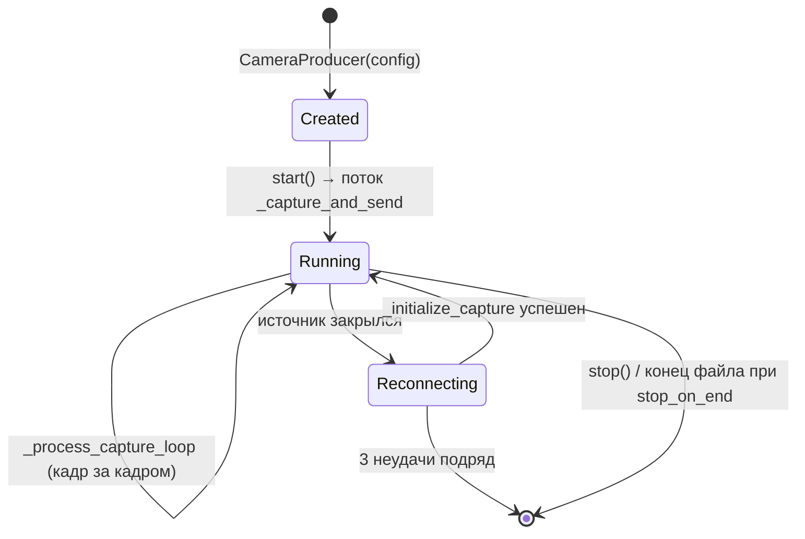

# `src/video_producing` — захват видео и публикация кадров

Единственная задача модуля: превратить видеоисточник (веб-камера, RTSP,
файл) в поток JPEG-кадров в Kafka-топике `raw-video-frames`. О том, что
происходит с кадрами дальше, модуль ничего не знает.

```
src/video_producing/
├── __init__.py     — экспорт CameraConfig, CameraProducer
├── config.py       — CameraConfig: все параметры сессии
└── producer.py     — CameraProducer: поток захвата + отправка в Kafka
```

---

## `CameraConfig` ([config.py](../../src/video_producing/config.py))

Dataclass со всеми параметрами одной сессии. Создаётся либо вручную
(в [`producer.py`](../../producer.py)), либо
[`SessionManager._spawn`](web_server.md) по запросу из UI.

| Поле | Тип | Default | Назначение |
|---|---|---|---|
| `camera_id` | `str` | — | Уникальный ID сессии; ключ Kafka-сообщений и ключ кэшей во всём пайплайне |
| `source` | `str \| int` | — | Индекс устройства (`0`), путь к файлу или URL (RTSP/HTTP) |
| `kafka_servers` | `str` | — | bootstrap-серверы |
| `topic_name` | `str` | — | Топик для кадров (`raw-video-frames`) |
| `partition` | `int` | — | Целевая партиция |
| `total_partitions` | `int` | `5` | Берётся по модулю: `partition % total_partitions` |
| `frame_rate` | `int` | `10` | Целевой FPS; задаёт паузу между итерациями захвата |
| `quality` | `int` | `80` | Качество JPEG (1–100) |
| `max_message_size` | `int` | `10 МБ` | Кадры крупнее отбрасываются |
| `reconnect_timeout` | `int` | `5` | Пауза перед повторной попыткой открыть источник |
| `max_width` / `max_height` | `int` | `1280` / `720` | Кадр уменьшается, если превышает |
| `stop_on_end` | `bool` | `False` | `True` для загруженных файлов: по концу файла продюсер останавливается, а не переоткрывает источник |
| `tracker_name` | `str?` | `None` | Уезжает в `session_config` сообщения → выбор трекера в пайплайне |
| `emotion_model` | `str?` | `None` | То же для модели эмоций |
| `compute_device` | `str?` | `None` | То же для `cpu` / `cuda` |

Последние три поля — это и есть механизм per-session routing: конфигурация
путешествует вместе с кадрами, поэтому пайплайн не нуждается в отдельном
канале управления.

---

## `CameraProducer` ([producer.py](../../src/video_producing/producer.py))

### Жизненный цикл



### Публичные методы

| Метод | Назначение |
|---|---|
| `start()` | Поднимает daemon-поток `_capture_and_send`. Повторный вызов игнорируется с warning |
| `stop()` | Останавливает цикл, освобождает `VideoCapture`, ждёт поток до 10 с, делает `producer.flush(5)` и пишет итоговую статистику |
| `get_stats()` | Словарь для API: `frames_sent`, `errors`, `current_fps`, `is_running`, `progress`, `position_sec`, `video_duration_sec`, `total_frames` |
| `__del__` | Вызывает `stop()` — страховка от «забытых» продюсеров |

### Внутренний цикл

1. **`_capture_and_send`** — внешний цикл живучести: если источника нет,
   зовёт `_initialize_capture`, считает подряд идущие неудачи, после трёх
   останавливается совсем.
2. **`_initialize_capture`** — открывает `cv2.VideoCapture`. На Windows для
   числовых источников принудительно используется `cv2.CAP_DSHOW`:
   дефолтный MSMF-бэкенд на Intel 11-го поколения часто долго
   инициализируется или вообще не открывает камеру. Здесь же читаются
   `CAP_PROP_FPS` и `CAP_PROP_FRAME_COUNT` — из них считается длительность
   видео для прогресс-бара в UI.
3. **`_process_capture_loop`** — читает кадры, вызывает `_process_frame`,
   раз в 100 кадров логирует эффективный FPS и спит
   `max(0, 1/frame_rate - elapsed)`. Для файлов при `stop_on_end=True`
   конец файла завершает продюсер (иначе видео зациклилось бы).
4. **`_process_frame`** — `_resize_frame` → `cv2.imencode('.jpg', quality)` →
   проверка размера → `_create_message` → `_send_to_kafka`.
5. **`_create_message`** — упаковывает msgpack-словарь (формат — в
   [CODE_OVERVIEW §4](../CODE_OVERVIEW.md#4-форматы-сообщений)). `session_config`
   кладётся только если задано хотя бы одно из трёх полей выбора алгоритмов.
6. **`_send_to_kafka`** — `produce(...)` + `poll(0)`; `BufferError` означает
   переполненную очередь librdkafka, кадр в этом случае теряется осознанно
   (лучше уронить кадр, чем накапливать задержку).

### Настройки Kafka-продюсера

```python
'batch.size': 32768, 'linger.ms': 10,      # склеиваем мелкие сообщения
'compression.type': 'lz4',                  # дёшево по CPU, ощутимо по сети
'retries': 5, 'retry.backoff.ms': 500,
'queue.buffering.max.messages': 100000,
'queue.buffering.max.kbytes': 1048576,      # 1 ГБ буфера
'enable.idempotence': True,                 # без дублей при ретраях
```

### Метрики FPS

Два разных числа, их легко перепутать:

- `_rolling_fps()` — скользящее среднее по последним 30 кадрам
  (`_fps_window`), именно оно уходит в API и на фронтенд как `current_fps`;
- лог раз в 100 кадров — «эффективный FPS» за окно, полезен при отладке
  (виден зазор между целевым `frame_rate` и реальным).

---

## Особенности и подводные камни

- **Продюсер живёт в процессе веб-сервера.** `SessionManager` создаёт
  `CameraProducer` в потоке `webapp.py`, поэтому «тяжёлый» `stop()` (до
  ~15 с) вынесен в `BackgroundTasks` — иначе он блокировал бы воркер API.
- **Кадры не нумеруются глобально.** `frame_id` — счётчик внутри продюсера,
  уникален только в пределах `camera_id`. Аннотатор синхронизирует пары
  «кадр ↔ аннотация» по `frame_id`, поэтому при нескольких одновременных
  сессиях возможны совпадения id между камерами.
- **Ограничение размера сообщения** (`max_message_size`) должно быть не
  больше брокерского `KAFKA_MESSAGE_MAX_BYTES` (10 МБ в
  [`docker-compose.yml`](../../docker-compose.yml)); веб-сервер ставит 5 МБ.
- **`__del__` вызывает `stop()`** — при отладке в REPL сборщик мусора может
  остановить продюсер в неожиданный момент; храните ссылку на объект.
