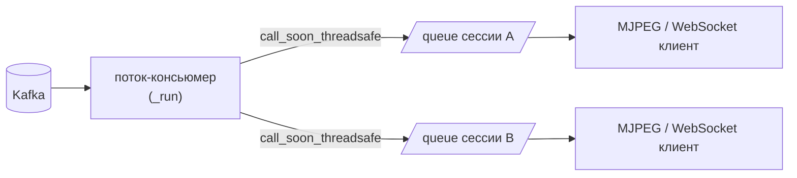

# `src/web_server` — FastAPI-сервер

Единственная точка входа для фронтенда: создаёт и останавливает сессии,
раздаёт аннотированное видео (MJPEG), транслирует события аналитики
(WebSocket) и отдаёт историю эмоций из Postgres.

```
src/web_server/
├── main.py                  — сборка приложения, lifespan, CORS, /api/health
├── config.py                — Settings (переменные окружения, пути, дефолты)
├── schemas.py               — pydantic-модели запросов/ответов
├── routes/
│   ├── sessions.py          — CRUD сессий-камер
│   ├── uploads.py           — загрузка файлов и запуск обработки
│   ├── streams.py           — MJPEG-стрим
│   ├── events.py            — WebSocket с аналитикой
│   └── history.py           — поиск по лицу, история, CSV-экспорт
└── services/
    ├── session_manager.py   — реестр сессий и запуск CameraProducer
    ├── stream_dispatcher.py — Kafka annotated-video → подписчики
    ├── events_dispatcher.py — Kafka vision-analytics → подписчики
    ├── db.py                — пул соединений psycopg2
    └── face_search.py       — поиск похожих лиц по фотографии
```

---

## Жизненный цикл ([main.py](../../src/web_server/main.py))

```python
@asynccontextmanager
async def lifespan(_: FastAPI):
    db_service.init_pool()            # пул psycopg2
    await stream_dispatcher.start()   # поток-консьюмер annotated-video
    await events_dispatcher.start()   # поток-консьюмер vision-analytics
    yield
    session_manager.stop_all()        # остановить все продюсеры
    await stream_dispatcher.stop()
    await events_dispatcher.stop()
    db_service.close_pool()
```

CORS открыт для `http://localhost:5173` и `http://127.0.0.1:5173` (Vite
dev-сервер). В проде фронтенд отдаётся nginx-ом на `:8080`, а `/api`
проксируется — см. [`frontend/nginx.conf`](../../frontend/nginx.conf).

---

## Конфигурация ([config.py](../../src/web_server/config.py))

| Настройка | Переменная окружения | Default |
|---|---|---|
| `KAFKA_BOOTSTRAP` | `AFFECTRA_KAFKA` | `localhost:9092` |
| `TOPIC_RAW` / `TOPIC_ANALYTICS` / `TOPIC_ANNOTATED` | `AFFECTRA_TOPIC_*` | `raw-video-frames` / `vision-analytics` / `annotated-video` |
| `DB_HOST` / `DB_PORT` / `DB_NAME` / `DB_USER` / `DB_PASSWORD` | `AFFECTRA_DB_*` | `localhost` / `5433` / `emotions` / `app_user` / `basic_app_password` |
| `UPLOADS_DIR` | — | `<repo>/data/uploads` (создаётся при импорте) |
| `DEFAULT_FRAME_RATE` / `DEFAULT_QUALITY` | — | `60` / `60` |
| `DEFAULT_MAX_WIDTH` / `DEFAULT_MAX_HEIGHT` | — | `854` / `480` |
| `MAX_UPLOAD_SIZE_MB` | — | `2048` |

---

## Схемы данных ([schemas.py](../../src/web_server/schemas.py))

| Модель | Назначение |
|---|---|
| `SessionConfig` | `tracker` (`deepsort`/`bytetrack`), `model` (11 вариантов), `device` (`cpu`/`cuda`) |
| `CreateCameraRequest` | `name`, `source`, `frame_rate=20`, `config` |
| `CreateUploadRequest` | `upload_id`, `name`, `frame_rate`, `config` |
| `SessionInfo` | Полное состояние сессии: `status`, `frames_sent`, `errors`, `fps`, `progress`, `position_sec`, `duration_sec`, … |
| `UploadInfo` | `upload_id`, `filename`, `size`, `saved_path`, `uploaded_at` |
| `HealthInfo` | `status`, `kafka`, `sessions`, `uploads_dir` |

Статусы сессии: камера — `live` / `error` / `offline`; загруженный файл —
`running` / `error` / `done`.

> Докстринг у `SessionConfig` («сохраняются как метаданные») устарел:
> конфигурация действительно доходит до пайплайна — `SessionManager`
> кладёт её в `CameraConfig`, а продюсер добавляет в каждое
> Kafka-сообщение как `session_config`.

---

## Сервисы

### `SessionManager` ([session_manager.py](../../src/web_server/services/session_manager.py))

Потокобезопасный реестр `Dict[str, _Session]` под `threading.Lock`.

| Метод | Что делает |
|---|---|
| `create_camera(name, source, frame_rate, config)` | `camera_id = cam_<6 hex>`, далее `_spawn` |
| `create_upload(name, upload_path, frame_rate, config)` | `camera_id = upload_<6 hex>`, `stop_on_end=True`, запоминает имя и размер файла |
| `list(kind=None)` / `get(id)` | Снимок состояния в виде `SessionInfo` |
| `detach(id)` | Снимает сессию из реестра и **возвращает продюсер, не останавливая его** |
| `shutdown_producer(producer, id)` | Останавливает продюсер (до ~15 с) — вызывается в `BackgroundTasks` |
| `stop(id)` / `stop_all()` | Синхронная остановка (используется в `lifespan`) |

`_probe_source(source)` перед запуском открывает источник через
`cv2.VideoCapture` и проверяет, что тот отдаёт хотя бы один кадр. Так
недоступная камера превращается в честную ошибку `400` вместо «зависшей»
сессии без кадров.

`_Session.info()` собирает статус: продюсер считается живым, если
`is_running` **и** его поток жив; для загрузок «прогресс 0 при status=done
и отправленных кадрах» дорисовывается в `1.0`.

### `StreamDispatcher` и `EventsDispatcher`

Устроены одинаково: фоновый поток читает свой Kafka-топик и раскладывает
сообщения по `asyncio.Queue` подписчиков через `loop.call_soon_threadsafe`.



| | `StreamDispatcher` | `EventsDispatcher` |
|---|---|---|
| Топик | `annotated-video` | `vision-analytics` |
| Формат | msgpack → `annotated_frame` (JPEG) | JSON → весь payload |
| Размер очереди | 4 | 32 |

Обе используют `_safe_put`: при переполнении очереди **выбрасывается самый
старый элемент**. Медленный клиент отстаёт по картинке, но не тормозит
остальных и не растит память.

`group.id` включает `id(self)` — каждый экземпляр веб-сервера получает свою
consumer-группу и, значит, все сообщения, а не их часть.

### `db.py` — пул соединений

`SimpleConnectionPool(min=1, max=6)` + контекст-менеджер `get_cursor()`,
который выдаёт `RealDictCursor` и гарантированно возвращает соединение в
пул. `with conn:` фиксирует транзакцию (commit/rollback) автоматически.

### `FaceSearch` ([face_search.py](../../src/web_server/services/face_search.py))

Поиск человека в базе по фотографии.

1. Лениво поднимает `FaceDetector(min_detection_confidence=0.5)` и
   `FaceEncoder(warmup=True)` — тяжёлые модели грузятся при первом поиске,
   а не при старте сервера.
2. `cv2.imdecode` → выбирается **самое крупное** найденное лицо →
   ресайз до 160×160 → эмбеддинг FaceNet.
3. SQL: top-K по `embedding <=> %s::vector` c джойном агрегатов —
   `first_seen`, `last_seen`, число треков, суммарное число сэмплов.
4. Для каждого найденного отдельным запросом добирается доминирующая
   эмоция.

Ошибки «не найдено лиц» и «не удалось декодировать» — это `ValueError`,
который роутер превращает в HTTP 400.

---

## HTTP API

### Сессии — [`routes/sessions.py`](../../src/web_server/routes/sessions.py)

| Метод | Путь | Описание |
|---|---|---|
| GET | `/api/sessions?kind=camera\|upload` | Список сессий |
| GET | `/api/sessions/{id}` | Одна сессия (404, если нет) |
| POST | `/api/sessions/camera` | Создать сессию-камеру; ошибка источника → 400 |
| DELETE | `/api/sessions/{id}` | `detach` синхронно + остановка продюсера в фоне |
| DELETE | `/api/sessions?kind=…` | То же для всех (или только одного типа) |

### Загрузки — [`routes/uploads.py`](../../src/web_server/routes/uploads.py)

| Метод | Путь | Описание |
|---|---|---|
| GET | `/api/uploads` | Файлы в `data/uploads`, новые сверху |
| POST | `/api/uploads` | Загрузка по 1 МБ чанками; 415 — расширение, 413 — размер |
| POST | `/api/uploads/session` | Создать сессию по `upload_id` |
| DELETE | `/api/uploads/{id}` | Удалить файл |

Разрешённые расширения: `.mp4`, `.mov`, `.mkv`, `.avi`, `.webm`.
Файл сохраняется как `<upload_id><ext>`, исходное имя в файловой системе не
сохраняется.

### Видео и события

| Метод | Путь | Описание |
|---|---|---|
| GET | `/api/stream/{id}` | MJPEG (`multipart/x-mixed-replace`). Раз в 5 с без кадров шлётся пустая часть, чтобы соединение не считалось мёртвым; при разрыве подписка снимается в `finally` |
| WS | `/api/events/{id}` | `{"kind": "analytics", "data": {...}}`; раз в 15 с тишины — `{"kind": "ping"}`. Несуществующая сессия → close с кодом 1008 |

### История — [`routes/history.py`](../../src/web_server/routes/history.py)

| Метод | Путь | Описание |
|---|---|---|
| POST | `/api/history/search?top_k=5` | Поиск похожих лиц по загруженному изображению |
| GET | `/api/history/users` | Сводка по всем лицам |
| GET | `/api/history/users/{id}` | Полная история: треки, `label_counts`, итоги |
| GET | `/api/history/users/{id}/face` | JPEG лица (`Cache-Control: max-age=86400`) |
| GET | `/api/history/users/{id}/export.csv` | Потоковый CSV по пользователю |
| GET | `/api/history/sessions/{id}` | История конкретной сессии (`data->>'camera_id'`) |
| GET | `/api/history/sessions/{id}/export.csv` | Потоковый CSV по сессии |

Агрегация меток идёт на стороне Postgres через
`LATERAL jsonb_array_elements(data->'samples')` — по строке на сэмпл без
выгрузки JSON в Python.

CSV генерируется через генератор (`StreamingResponse`), строка за строкой:
`user_id, camera_id, track_id, created_at, sample_ts, sample_iso, label,
top_score` + восемь колонок вероятностей.

### Служебное

| Метод | Путь | Описание |
|---|---|---|
| GET | `/api/health` | Статус, число сессий, каталог загрузок |
| GET | `/` | Ссылки на `/docs` и `/api/health` |

---

## Особенности и подводные камни

- **`kafka: true` в `/api/health` захардкожен** (в коде стоит `TODO`) —
  реальной проверки брокера нет.
- **Состояние сессий живёт в памяти процесса.** Рестарт `webapp.py` теряет
  реестр; загруженные файлы при этом остаются на диске (в Docker — в
  volume `uploads`).
- **Остановка продюсера асинхронна.** После `DELETE /api/sessions/{id}`
  сессия мгновенно исчезает из списка, но кадры могут идти ещё несколько
  секунд, пока фоновая задача завершает `producer.stop()`.
- **Аутентификации нет.** Сервис рассчитан на локальную сеть; вынос наружу
  требует как минимум reverse-proxy с авторизацией.
- **Тяжёлые модели в процессе API.** Первый вызов `/api/history/search`
  занимает секунды — грузятся MediaPipe и FaceNet.
